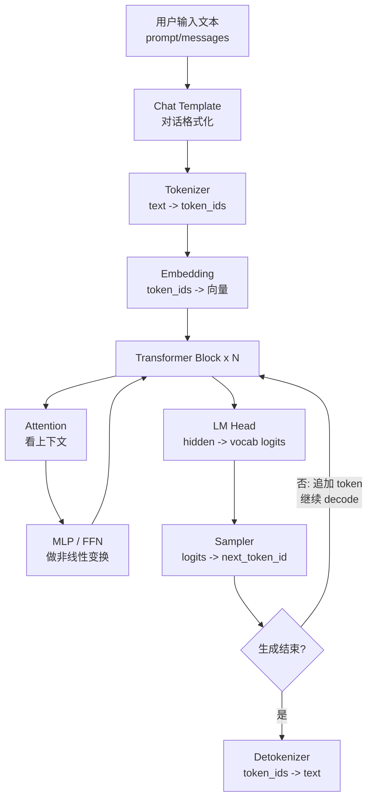
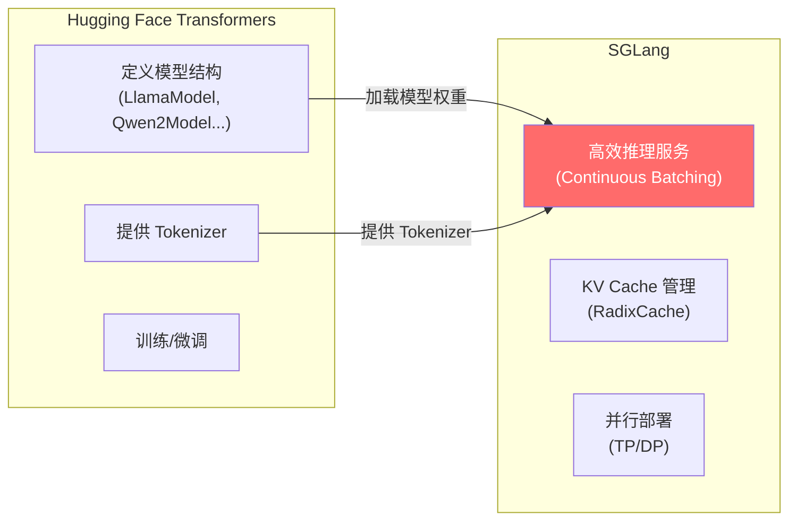

# 前置知识：Python 构建 + Transformers + 数学基础

> 目标：花 2-3 小时补齐看 SGLang 源码所需的背景知识。
> 受众：会写 Python 脚本，但没接触过 ML/深度学习的开发者。
> 方式：每个概念附带**可直接运行的代码**，不讲理论细节。
>
> **下一步**: 完成本文后，开始 [Week 1](../01-architecture/foundations.md) 或先搭建 [Mac 调试环境](../setup/mac-debug.md)。
> **进阶数学**: 如需了解 GPU 算力/带宽对性能的影响，见 [performance-intuition.md](../05-reference/performance-intuition.md)。

---

## Part 1: Python 构建基础

### 1.1 虚拟环境 (venv / uv)

**为什么不直接 `pip install`？**

直接装在系统 Python 里，不同项目的依赖会冲突（A 要 torch 2.0，B 要 torch 2.3）。虚拟环境 = 每个项目有自己独立的 `site-packages`。

```bash
# 创建虚拟环境 (uv 是更快的替代品，用法几乎和 venv 一样)
uv venv python/.venv --python 3.13

# 激活后，python/pip 指向虚拟环境里的版本
source python/.venv/bin/activate
which python  # → .../python/.venv/bin/python

# 安装包只影响这个虚拟环境
pip install numpy
```

### 1.2 PYTHONPATH 的作用

Python 在 `import` 时会在一系列目录中搜索模块。`PYTHONPATH` 可以往这个搜索列表里加目录。

```bash
# SGLang 的源码在 python/ 目录下，兼容层在 sglang-learning-docs/ 下
# 不设置 PYTHONPATH 的话，Python 找不到它们
PYTHONPATH="sglang-learning-docs:python" python -c "import sglang; print('找到了!')"
```

**为什么 SGLang 要这样做？** 因为 SGLang 用的是"开发模式"——直接从源码目录 import，而不是先 `pip install` 再用。这样你改了代码立刻生效，不用重新安装。

### 1.3 import 机制

```python
# Python 搜索模块的顺序:
import sys
print(sys.path)
# 1. 当前目录
# 2. PYTHONPATH 里的目录
# 3. 虚拟环境的 site-packages
# 4. 系统 Python 的标准库

# 包 vs 模块:
# sglang/srt/managers/scheduler.py  ← 这是一个模块
# sglang/srt/managers/               ← 这是一个包 (有 __init__.py)
# import sglang.srt.managers.scheduler  ← 完整路径导入
```

### 1.4 给 Java 开发者的 Python 速记

如果你有 Java 背景，下表帮你快速建立对应关系：

| Python | Java 对应 | 说明 |
|---|---|---|
| `self` | `this` | Python 要求显式写在方法第一个参数，Java 隐式存在 |
| `**kwargs` | `Map<String, Object>` | 接收任意关键字参数；`Foo(**kwargs)` ≈ 用 map 的值填构造函数参数 |
| `@dataclass` | `record` (Java 14+) 或 Lombok `@Data` | 自动生成 `__init__`、`__eq__`、`__repr__` |
| `with open(...) as f:` | try-with-resources | 自动关闭资源，Python 叫 context manager |
| 多继承 + Mixin | 多个带 `default` 方法的 interface | 但 Python Mixin 可带字段（状态），Java interface 不行 |
| `ABC` + `@abstractmethod` | `abstract class` / `interface` | Python 无 `interface` 关键字，用 `abc` 模块模拟 |
| `list[int]` / `dict[str, Any]` | `List<Integer>` / `Map<String, Object>` | 类型注解不影响运行，仅供阅读和 IDE 补全 |
| `lambda x: x + 1` | `x -> x + 1` | 匿名函数 |
| 装饰器 `@foo` | 注解 `@Foo` + AOP | 装饰器在运行时包装函数，比 Java 注解更动态 |

```python
# Mixin 示例 — Java 开发者容易困惑的多继承
class LogMixin:
    """类似 Java 中一个带 default 方法的 interface"""
    def log(self, msg):
        print(f"[{self.__class__.__name__}] {msg}")

class Scheduler(LogMixin, SomeMixin):
    """相当于 class Scheduler implements LogMixin, SomeMixin"""
    def run(self):
        self.log("running")  # 从 LogMixin 继承来的方法

# SGLang 中看到 class Scheduler(MixinA, MixinB, MixinC):
# 只需关注 Scheduler 自己的方法，Mixin 按需深入
```

> **Tips**: 遇到不认识的 Python 语法，搜 "Python xxx for Java developers" 通常能找到很好的对比文章。

### 1.5 常见 Python Pattern (SGLang 中大量使用)

```python
# 1. dataclass — 自动生成 __init__ 的数据容器
from dataclasses import dataclass

@dataclass
class ServerConfig:
    host: str = "0.0.0.0"
    port: int = 30000
    model_path: str = ""

config = ServerConfig(model_path="meta-llama/Llama-3-8B")
print(config.port)  # 30000

# 2. Type Hints — 标注类型，不影响运行，但帮助阅读和 IDE 补全
def tokenize(text: str) -> list[int]:
    return [ord(c) for c in text]  # 简化示意

# 3. Enum — 枚举类型，比字符串常量更安全
from enum import IntEnum, auto
class ForwardMode(IntEnum):
    EXTEND = auto()   # 1
    DECODE = auto()   # 2
    MIXED = auto()    # 3

# SGLang 用 ForwardMode 区分 prefill 和 decode 阶段
```

### 1.6 多进程基础

SGLang 用多进程（不是多线程）来并行处理。为什么？因为 Python 有 GIL（全局解释器锁），多线程无法真正并行计算。

```python
from multiprocessing import Process, Queue
import time

def worker(name, q):
    """子进程：从队列取任务，处理后放回结果"""
    while True:
        task = q.get()
        if task == "STOP":
            break
        print(f"[{name}] 处理: {task}")
        time.sleep(0.1)

# 主进程创建队列和子进程
q = Queue()
p = Process(target=worker, args=("Worker-1", q))
p.start()

q.put("任务A")
q.put("任务B")
q.put("STOP")
p.join()
# SGLang 的 ZMQ 本质上做的事和 Queue 一样，但更灵活、跨机器
```

---

## Part 2: Transformers 快速理解

### 2.1 LLM 是什么？

大语言模型 (LLM) 本质上就是一个函数：

```
输入: 一段文字 (如 "今天天气")
输出: 下一个字的概率分布 (如 {"很": 0.6, "不": 0.2, "还": 0.1, ...})
```

然后从概率分布中选一个字（采样），拼到输入后面，再重复。这就是"自回归生成"。

### 2.2 Tokenizer：文字 ↔ 数字

模型不认识文字，只认识数字。Tokenizer 负责转换。

```python
# 可在 Mac 上直接运行 (需先 pip install transformers)
from transformers import AutoTokenizer

# 加载一个 tokenizer (不需要 GPU，只是查表操作)
tokenizer = AutoTokenizer.from_pretrained("gpt2")

# 文字 → 数字 (encode)
text = "Hello, world!"
ids = tokenizer.encode(text)
print(f"文字: {text}")
print(f"Token IDs: {ids}")        # [15496, 11, 995, 0]
print(f"Token 数量: {len(ids)}")  # 4

# 数字 → 文字 (decode)
recovered = tokenizer.decode(ids)
print(f"恢复: {recovered}")       # "Hello, world!"

# 查看每个 token 对应什么
for id in ids:
    print(f"  {id} → '{tokenizer.decode([id])}'")
```

**关键理解**: 一个 token ≠ 一个字。英文中一个 token 约 4 个字母，中文中一个 token 约 1-2 个字。

更完整的 tokenizer 机制，包括 vocab、BPE/SentencePiece、special token、chat template 和 SGLang 的 TokenizerManager/DetokenizerManager，见 [Tokenizer 内部机制](./tokenizer-internals.md)。

### 2.3 Chat Template (对话模板)

ChatGPT 风格的对话有固定格式：

```python
messages = [
    {"role": "system", "content": "You are a helpful assistant."},
    {"role": "user", "content": "Hello!"},
    {"role": "assistant", "content": "Hi! How can I help?"},
    {"role": "user", "content": "What is 2+2?"},
]

# Chat template 把上面的结构转成模型能理解的纯文本:
# <|system|>You are a helpful assistant.<|end|>
# <|user|>Hello!<|end|>
# <|assistant|>Hi! How can I help?<|end|>
# <|user|>What is 2+2?<|end|>
# <|assistant|>

# SGLang 中 TokenizerManager 负责这个转换
```

### 2.4 Transformer 基本架构与 SGLang 对应关系

先记住一句话：**LLM 是一个反复预测 next token 的 Transformer。SGLang 不训练模型，主要负责把这条推理流水线跑快、跑稳。**



最小执行流程：

```text
text
  -> token_ids
  -> embeddings
  -> transformer layers
  -> logits
  -> sampling next_token_id
  -> append token
  -> repeat
  -> decode text
```

| 术语 | 大白话 | 在 SGLang 中关注哪里 |
|---|---|---|
| Token | 模型处理的最小文本单位 | `TokenizerManager`, `DetokenizerManager` |
| token_id | token 在词表里的整数编号 | `input_ids`, `output_ids` |
| Embedding | 把 token_id 查表变成向量 | 模型第一层，`ModelRunner.forward()` 内部 |
| Hidden State | 每层 Transformer 处理后的向量 | `ForwardBatch`, model executor |
| Transformer Block | Attention + MLP 的重复层 | `model_executor/models/` 下各模型实现 |
| Attention | 当前 token 参考历史 token 的机制 | attention backend, KV Cache |
| Q/K/V | Attention 的三组向量：查什么、有什么、取什么 | KV Cache 主要缓存 K/V |
| KV Cache | 已算过的 Key/Value，decode 时复用 | `mem_cache/`, `RadixCache`, KV pool |
| Logits | 模型给每个词表 token 的分数 | `logits_processor`, sampler 前 |
| Sampler | 从 logits 里选下一个 token | `sampling/` |
| Prefill | 第一次处理完整 prompt | `ForwardMode.EXTEND` |
| Decode | 每次只生成 1 个或少量新 token | `ForwardMode.DECODE` |

Transformer 和 SGLang 的分工：

| 层级 | 解决什么 | SGLang 做什么 |
|---|---|---|
| Transformer 模型 | 给定 token 序列，预测下一个 token | 加载模型并调用 forward |
| Tokenizer | 文本和 token_id 互转 | 独立放到 Tokenizer/Detokenizer 管理器 |
| KV Cache | 避免重复算历史上下文 | 管理显存页、前缀复用、淘汰 |
| Scheduler | 多个请求怎么排队和合批 | Continuous Batching、prefill/decode 调度 |
| Sampler | logits 怎么变成输出 token | temperature/top-p/top-k 等采样 |

推理时最重要的两个阶段：

| 阶段 | 输入 | 计算特点 | 为什么 SGLang 很重视 |
|---|---|---|---|
| Prefill | 完整 prompt | 一次处理很多 token，计算量大 | 需要 chunked prefill、前缀缓存 |
| Decode | 上一步新 token + 历史 KV | 每轮通常只生成 1 个 token，但要反复跑 | 需要 continuous batching、KV Cache、高效调度 |

### 2.5 模型文件的构成

从 Hugging Face 下载一个模型，里面有什么？

```
meta-llama/Llama-3-8B-Instruct/
├── config.json              # 模型结构 (层数、维度、注意力头数)
├── tokenizer.json           # Tokenizer 的词表和规则
├── model.safetensors        # 模型权重 (参数值，这个文件最大，几十 GB)
├── generation_config.json   # 生成参数默认值
└── special_tokens_map.json  # 特殊 token (EOS, PAD 等)
```

### 2.6 SGLang 和 Transformers 的关系



简单说：**Transformers 负责"定义模型长什么样"，SGLang 负责"让模型跑得又快又稳"**。

---

## Part 3: 数学基础

数学内容已经拆成独立文档：[LLM 推理数学基础](./math-for-llm.md)。

这篇文档按大一新生水平讲：

| 主题 | 为什么要学 |
|---|---|
| 标量/向量/矩阵/张量 | 看懂 `input_ids`, `hidden_states`, `logits` 的 shape |
| 矩阵乘法 | 看懂 Transformer 每层在做什么 |
| logits/softmax/概率 | 看懂 sampler 为什么能选 token |
| temperature/top-p | 看懂采样参数如何影响输出 |
| Attention/QKV | 看懂 Transformer 为什么能读上下文 |
| KV Cache | 看懂 SGLang 为什么重视显存管理和前缀缓存 |

如果你没有线性代数、概率论基础，先读它，再进入 Week 1。

---

## 自查：你准备好了吗？

读完上面的内容后，你应该能回答：

- [ ] `PYTHONPATH="sglang-learning-docs:python"` 这行命令是在做什么？
- [ ] `tokenizer.encode("Hello world")` 的返回值是什么类型？
- [ ] `token_id` 为什么要转成 embedding？
- [ ] logits 和 probability 有什么区别？
- [ ] KV Cache 为什么能加速 decode？
- [ ] 为什么 SGLang 用多进程而不是多线程？(GIL)

全部能答上来 → 你已经准备好进入 Week 1 了！
