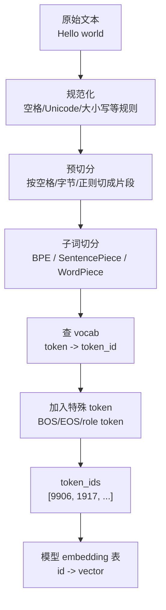
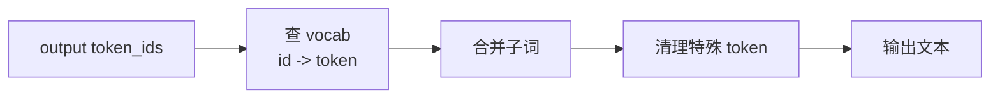
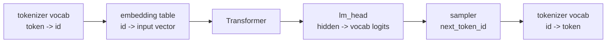
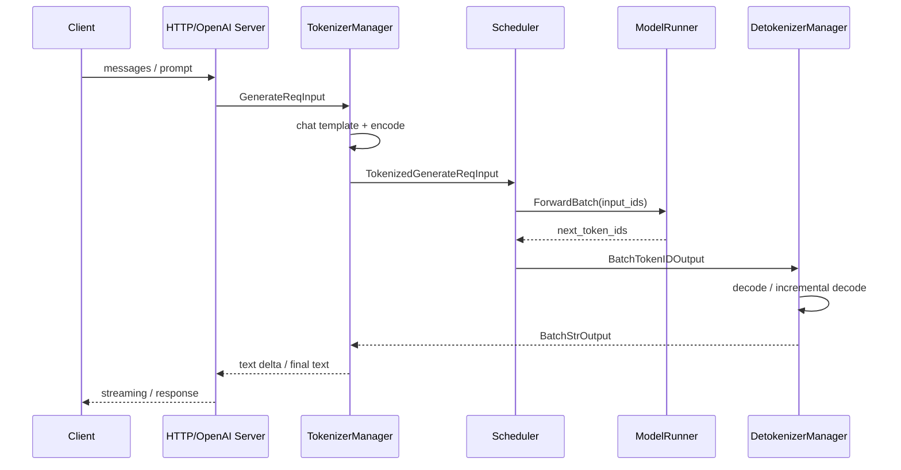

# Tokenizer 内部机制：text 和 token_id 如何互转

> 目标：看懂 `tokenize text -> token_ids` 到底做了什么，以及它和模型、SGLang 的关系。
> 适合读者：会基础 Python，但不熟悉 NLP / Transformer。
> 先读：如果你还不知道 Transformer 主流程，先看 [Transformer 基本架构](./prerequisites.md#24-transformer-基本架构与-sglang-对应关系)。

## 1. 一句话结论

**Tokenizer 是模型的“文字协议”。它把人类文本变成模型训练时见过的 token_id，也把模型输出的 token_id 还原成人能读的文本。**

```text
text  --encode/tokenize-->  token_ids  --模型推理-->  output_token_ids  --decode/detokenize-->  text
```

| 问题 | 答案 |
|---|---|
| tokenizer 是模型吗 | 不是，它通常是规则 + 词表 |
| tokenizer 需要 GPU 吗 | 不需要，通常 CPU 查表和字符串处理 |
| tokenizer 和模型绑定吗 | 绑定，token_id 必须对应模型 embedding 表 |
| detokenizer 是另一套东西吗 | 不是，同一套 tokenizer 配置反向使用 |
| 不同模型 tokenizer 一样吗 | 不一定，Llama/Qwen/DeepSeek/GPT 系列经常不同 |

## 2. 基本流程图



反向过程：



## 3. token / vocab / token_id

| 概念 | 大白话 | 例子 |
|---|---|---|
| token | 模型处理的文本小块 | `"Hello"`, `" world"`, `"你"` |
| vocab | token 到 id 的表 | `"Hello" -> 9906` |
| token_id | token 在 vocab 里的整数编号 | `9906` |
| special token | 有控制含义的特殊 token | `<bos>`, `<eos>`, `<|user|>` |

关键约束：

```text
token_id = 1234
  -> tokenizer vocab 第 1234 项
  -> 模型 embedding 表第 1234 行
  -> lm_head 输出第 1234 维
```

所以 tokenizer 不能随便换。换错后，模型看到的 id 含义就错了。

## 4. 为什么一个 token 不等于一个字

Tokenizer 通常按“子词”切分，而不是按字切分。

| 文本 | 可能的 token 形态 | 原因 |
|---|---|---|
| `Hello` | `Hello` | 高频词，直接作为一个 token |
| `unbelievable` | `un`, `believable` 或更多片段 | 低频词拆成子词 |
| ` world` | ` world` | 很多 tokenizer 把前导空格放进 token |
| `你好` | `你`, `好` 或 `你好` | 取决于模型 tokenizer |
| emoji | 可能拆成多个 byte token | 字符集覆盖方式不同 |

常见机制：

| 机制 | 核心想法 | 常见模型 |
|---|---|---|
| BPE | 从字符/字节开始，把高频相邻片段不断合并 | GPT/Llama 系列常见 |
| SentencePiece | 不依赖空格，适合多语言和中文日文 | Llama/Qwen/一些多语模型 |
| WordPiece | 类似子词切分，BERT 系常见 | BERT/早期 encoder 模型 |

## 5. encode 和 decode 不是简单反函数

正常情况：

```text
decode(encode(text)) ≈ text
```

但不是永远逐字节完全一致，原因包括：

| 原因 | 影响 |
|---|---|
| Unicode 规范化 | 某些等价字符可能被统一 |
| 空格合并规则 | 前导空格可能属于 token 本身 |
| special token 清理 | decode 时可能跳过 `<eos>` 等 |
| byte fallback | 生僻字符可能拆成多个 byte token |
| chat template | messages 不是直接 encode，而是先渲染成 prompt |

最小 Python 实验：

```python
from transformers import AutoTokenizer

tokenizer = AutoTokenizer.from_pretrained("gpt2")
text = "Hello world"

ids = tokenizer.encode(text)
tokens = tokenizer.convert_ids_to_tokens(ids)
back = tokenizer.decode(ids)

print(ids)
print(tokens)
print(back)
```

观察重点：

| 输出 | 你要看什么 |
|---|---|
| `ids` | 模型真正吃进去的是整数列表 |
| `tokens` | token 可能带空格或特殊前缀 |
| `back` | decode 是把 token 合并成人类文本 |

## 6. Chat Template：对话不是直接拼字符串

OpenAI 风格请求是结构化的：

```python
messages = [
    {"role": "system", "content": "You are helpful."},
    {"role": "user", "content": "Hello"},
]
```

模型实际训练时看到的是某种模板文本：

```text
<|system|>
You are helpful.
<|user|>
Hello
<|assistant|>
```

不同模型模板不同：

| 模型族 | 可能差异 |
|---|---|
| Llama Instruct | role token 和结束 token 有自己的格式 |
| Qwen Chat | chat template 不同，工具调用格式也不同 |
| DeepSeek Reasoning | 可能有 reasoning 相关标记 |
| GPT-OSS / Harmony | 对话格式和特殊 token 更复杂 |

所以“同一句用户输入”进入模型前通常经历：

```text
messages -> apply_chat_template -> prompt text -> encode -> token_ids
```

## 7. 和模型本身的关系

Tokenizer 和模型通过三张表绑定：



| 部分 | 作用 | 如果 tokenizer 错了 |
|---|---|---|
| vocab | 定义 token 和 id 的对应关系 | 输入 id 含义错 |
| embedding | 每个 id 的输入向量 | 查到错误行 |
| lm_head | 输出每个 id 的概率 | decode 成错误 token |
| special tokens | 控制开始、结束、角色 | 可能无法停止或格式错乱 |

一句话：**模型训练时用哪套 tokenizer，推理时就必须用哪套。**

## 8. SGLang 里的位置



| SGLang 组件 | 负责什么 |
|---|---|
| `TokenizerManager` | 接收请求，处理 prompt/messages，生成 `input_ids` |
| `Scheduler` | 不关心字符串，只调度 token_ids 和请求状态 |
| `ModelRunner` | 只吃 tensor，不认识自然语言 |
| `DetokenizerManager` | 把输出 token_ids 还原成文本，支持流式增量输出 |

源码定位：

| 文件 | 看什么 |
|---|---|
| `python/sglang/srt/managers/tokenizer_manager.py` | `TokenizerManager`, `tokenizer.encode(...)` |
| `python/sglang/srt/managers/detokenizer_manager.py` | `DetokenizerManager`, `tokenizer.decode(...)`, `batch_decode(...)` |
| `python/sglang/srt/entrypoints/openai/serving_chat.py` | `apply_chat_template(...)`, chat 请求如何变成 prompt ids |
| `python/sglang/srt/entrypoints/engine.py` | Tokenizer/Scheduler/Detokenizer 进程如何启动 |

## 9. 常见坑

| 坑 | 现象 | 正确理解 |
|---|---|---|
| 混用 tokenizer | 输出乱码、质量差、停止符异常 | tokenizer 和模型必须配套 |
| 忽略 chat template | instruct 模型回答怪 | chat 模型需要训练时的对话格式 |
| 把 token 当字符 | 长度估算错 | token 数和字符数不是一回事 |
| 忽略 special tokens | BOS/EOS 重复或缺失 | 不同模型规则不同 |
| streaming decode 直接逐 token decode | 空格/Unicode 可能不完整 | 需要增量 detokenize 逻辑 |

## 10. 自查

- [ ] tokenizer 和 detokenizer 是否必须同一套 vocab？
- [ ] `token_id` 为什么能直接查 embedding 表？
- [ ] 为什么 chat 请求要先过 `apply_chat_template`？
- [ ] 为什么同一段文本在不同模型下 token 数可能不同？
- [ ] SGLang 中 Scheduler 为什么不处理字符串？

能答上来，再去看 [Week 1 请求生命周期](../01-architecture/foundations.md) 会顺很多。
