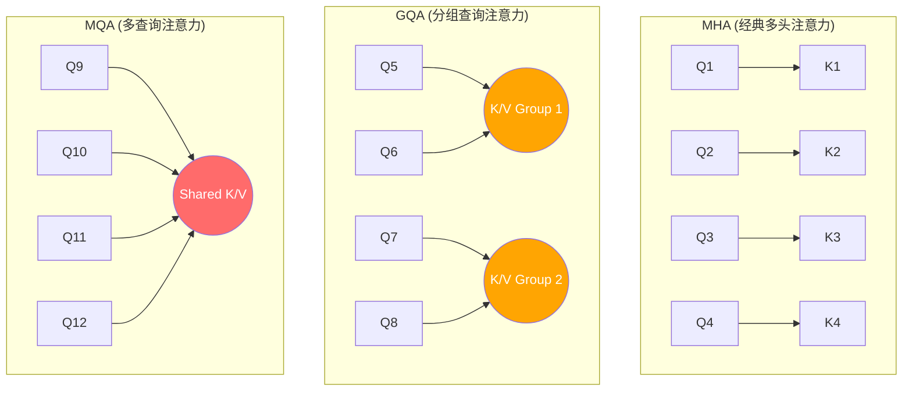
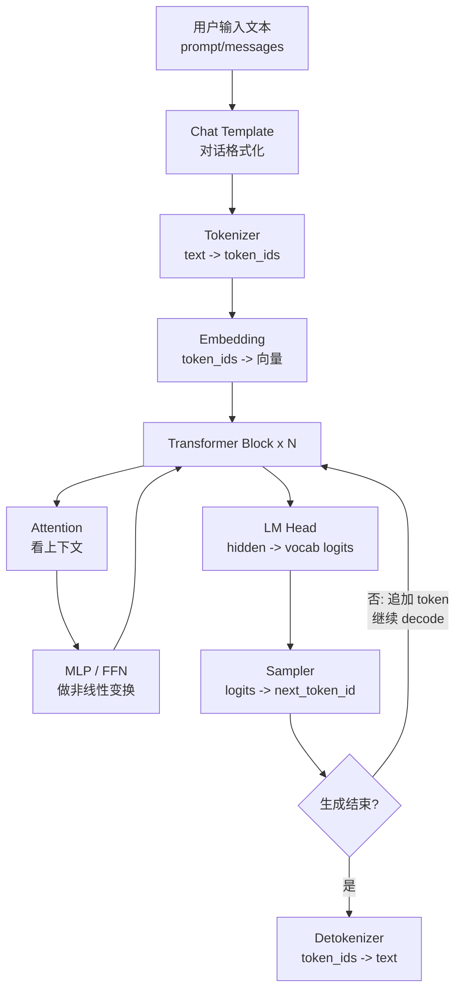
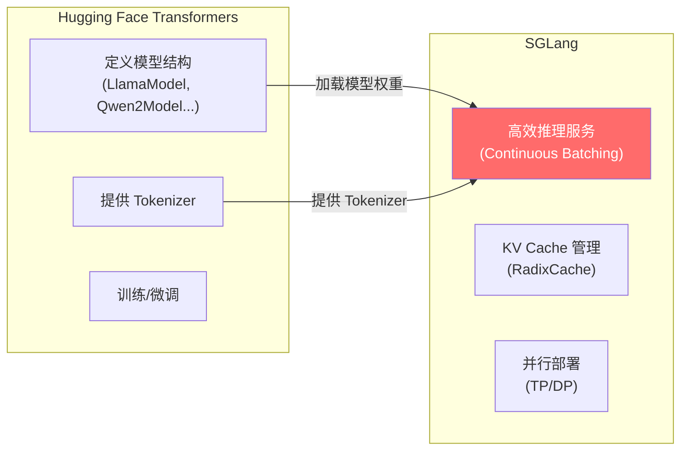

# 现代大语言模型 Transformer 架构：从原理到 SGLang 映射

> **目标**：为大一新生提供一站式的 Modern Transformer 核心架构与 SGLang 源码映射指南。
> **前置知识**：已了解 [prerequisites.md](./prerequisites.md) 中的 Tokenizer 概念。
> **关联数学**：阅读本章比喻后，若想深入公式推导，可点击对应链接查阅 [math-for-llm.md](./math-for-llm.md)。

---

## 1. LLM 是什么？（自回归生成）

大语言模型 (LLM) 本质上就是一个函数：

```
输入: 一段文字 (如 "今天天气")
输出: 下一个字的概率分布 (如 {"很": 0.6, "不": 0.2, "还": 0.1, ...})
```

然后从概率分布中选一个字（采样），拼到输入后面，再重复。这种“预测下一个词并不断追加”的机制，在学术上被称为**“自回归生成”（Autoregressive Generation）**。

---

## 2. 从 2017 原始 Transformer 到现代 Decoder-Only 架构

大一同学在网上搜索“Transformer”时，往往会看到很多 2017 年初代论文（Vaswani et al.）的经典图示，里面包含 **Encoder（编码器）** 和 **Decoder（解码器）** 两个大框。

然而，包括 GPT-4、Llama 3、Qwen 2、DeepSeek 在内的现代大语言模型，全部采用的是 **Decoder-Only（仅解码器）** 架构。为了看懂 SGLang 源码，你需要厘清以下概念：

* **Encoder-Decoder（经典架构，如 T5、BART）**：
  * 输入（Prompt）送入 Encoder 进行全向关注（没有 Causal Mask，即每个词能看到前后所有的词）。
  * 输出（生成的回复）送入 Decoder。Decoder 内部不仅有自注意力，还有**交叉注意力（Cross-Attention）**去读取 Encoder 提取出的特征。常用于翻译、摘要等任务。
* **Decoder-Only（现代大模型架构，如 Llama、DeepSeek）**：
  * 没有独立的 Encoder，取消了 Cross-Attention。
  * 将输入（Prompt）和输出直接拼接成一条长长的序列，全部通过**因果掩码（Causal Mask）**来保证生成新词时不能偷看未来。
* **胜出原因**：Decoder-Only 架构在**大规模参数和海量数据训练**时，展现出了更强的泛化能力和极佳的训练稳定性，且极易进行横向并行扩展。

---

## 3. 自回归生成循环极简仿真（Autoregressive Loop Code）

大模型生成文本是一个词一个词往外蹦的过程。下面是自回归生成的**极简 Python 仿真代码**，它展示了推理循环的本质（这也是 SGLang 中 `ModelRunner` 循环执行的逻辑）：

```python
# 极简自回归生成模拟 (可在 CPU 上直接运行)
import torch

# 假设 input_ids 是 Tokenizer 转化后的整数张量
# 对应文本: "今天天气"
input_ids = torch.tensor([[101, 234, 567]]) 

for step in range(10): # 循环生成 10 个词
    # 1. 将当前的序列送入 Transformer 模型进行前向传播
    outputs = model(input_ids) 
    
    # 2. 获取最后一个位置上对整个词表 (vocab) 的预测得分 (Logits)
    # shape: [1, vocab_size]
    next_token_logits = outputs.logits[:, -1, :] 
    
    # 3. 贪心解码：取概率/得分最高的一个词
    next_token = torch.argmax(next_token_logits, dim=-1, keepdim=True) 
    
    # 4. 核心：将新生成的词拼接（cat）到输入序列的尾部，作为下一次迭代的输入！
    input_ids = torch.cat([input_ids, next_token], dim=-1)
    
# 最终解码 input_ids 即可得到完整文本
```

---

## 4. 多头注意力（Multi-Head Attention）的维度拆分

在 SGLang 底层算子中，经常会遇到头维度（`head_dim`）和隐藏维度（`hidden_dim`）的转换。
* 假设模型的隐藏维度 $d_{\text{model}} = 4096$，共有 $H = 32$ 个注意力头。
* 每个头分配到的通道维度为 $d_k = d_{\text{model}} / H = 4096 / 32 = 128$。
* **运算逻辑**：Query 向量（Shape 为 `[seq_len, 4096]`）乘以投影矩阵后，在维度上被重新拆分（Reshape）为 `[seq_len, 32, 128]`。这 32 个头独立计算各自的注意力（分别看不同的上下文），最后将它们的 32 个输出重新拼接回 `[seq_len, 4096]`。
* **类比**：这习惯像 32 个不同视角的专家，第 1 个专家关注语法结构，第 2 个关注实体代词，第 3 个关注上下文逻辑。最后把所有专家的分析汇总。

---

## 5. 现代大模型（Llama-era）微观架构演进

大一同学在阅读 SGLang 底层模型代码（如 `ModelRunner` 和 `model_executor/models/`）时，会发现现代大模型最重要的五个微观架构升级，它们是读懂 SGLang 源码的核心“敲门砖”：

### 5.1 RMSNorm（均方根归一化）—— 信号的“稳定器”

> [!NOTE]
> **⚖️ RMSNorm：把所有数据拉到同一个“音量”**
> 
> 在上百层的神经网络中，前向计算就像是用传声器接力唱歌。如果前面的层唱得太响，后面的层耳朵会被震聋（数值爆炸）；如果前面的层唱得像蚊子哼，后面的层就听不见了（数值消失）。
> 
> **归一化（Normalization）** 就是自动调音台，把每层输出的数据强行调整到大小适中的范围。
> * **LayerNorm（经典做法）**：算出这一层所有数据的**平均值**（Mean）和**标准差**（Standard Deviation），把平均值归零，再除以标准差。这需要算两次，比较慢。
> * **RMSNorm（现代 LLM 做法）**：不求平均值了！只算**均方根（RMS）**（把所有数平方，求平均，再开根号），然后直接除以这个均方根。
> 
> **为什么可以省去平均值？** 科学家发现，在 LLM 中，把均值归零对模型效果几乎没有影响，但求均方根的速度比 LayerNorm 快很多。在寸秒寸金的 GPU 推理中，少算一步就能省下很多时间！
>
> 📐 **数学推导与计算细节**：详见 [RMSNorm 的数学](./math-for-llm.md#math-rmsnorm)。

### 5.2 RoPE（旋转位置编码）—— 向量的“时空旋转”

> [!TIP]
> **⏰ RoPE：用“时钟指针”代表词的位置**
> 
> 怎么让模型知道词在句子中的先后顺序？
> 
> 想象每一个词向量都是一个**时钟的指针（向量）**。
> * 第 1 个词（位置 1），我们将它的 Query 和 Key 向量在空间中**顺时针旋转 30 度**。
> * 第 2 个词（位置 2），我们将向量**旋转 60 度**。
> * 第 $n$ 个词（位置 $n$），我们将向量**旋转 $n \times 30$ 度**。
> 
> **为什么要旋转，而不是直接把位置数字加进去？**
> 因为两个向量做**点积（算相关性）**时，旋转之后的点积结果只和它们之间的**角度差（相对距离）**有关！
> 
> 比如位置 3 和位置 5 的相对距离是 2（夹角差 60 度）；位置 7 和位置 9 的相对距离也是 2（夹角差 60 度）。模型在做 Attention 时，能天然地感受到“这两个词隔得很近”，这叫做**相对位置感知**。
>
> 📐 **旋转矩阵及相对距离保留证明**：详见 [RoPE 的数学](./math-for-llm.md#math-rope)。

### 5.3 GQA（分组查询注意力）与 MLA（多头潜在注意力）—— 显存的“救生圈”



> [!IMPORTANT]
> **💡 为什么要从 MHA 变成 GQA / MLA？**
> 
> 经典的多头注意力（MHA）里，每个 Query 头都有一个专属的 Key 头和 Value 头。如果模型有 32 个头，每步 Decode 时，GPU 就要读写 32 份 KV Cache，显存瞬间被吃光。
> 
> * **MQA（多查询）**：所有 32 个 Query 头**共用 1 个** Key 和 Value 头。显存占用缩减到 1/32！但是效果掉得厉害，模型变笨了。
> * **GQA（分组查询）**：折中方案。32 个 Query 头分成 8 组，每组 4 个 Query 共用 1 个 Key 和 Value 头。**Llama 3 和 Qwen 2 都在使用它！** 显存占用变成 1/4，但效果几乎不掉。
> * **MLA（多头潜在注意力）**：**DeepSeek 的杀手锏！** 它通过数学把 KV Cache 压缩成一个低维度的“小行李箱”（Latent Vector），推理时再临时解压。这让 DeepSeek-R1 / V3 的 KV Cache 显存暴降了 90% 以上，使得极其便宜的 API 价格成为可能！
>
> 📐 **分组机制与低维潜在空间压缩公式**：详见 [GQA 与 MLA 的数学](./math-for-llm.md#math-gqa-mla)。

### 5.4 SwiGLU（激活函数与门控）—— 信息的“阀门”

> [!TIP]
> **🚰 SwiGLU：带“阀门”的特征过滤器**
> 
> 传统的全连接层（MLP）是直接算 $X \times W$。
> 现代大模型引入了“门控”（Gate）机制，类似于水管上的阀门。
> 
> SwiGLU 在前向传播时做两件事：
> 1. **通路 A**：计算特征向量。
> 2. **通路 B（门控通路）**：用 Swish 激活函数计算出一个 0 到 1 之间的“开关系数”（阀门开度）。
> 3. **合并**：把通路 A 的结果乘以通路 B 的系数。如果阀门是 0.9，信息流过 90%；如果是 0.1，流过 10%。
> 
> 这种“自己决定让多少信息通过”的结构，极大地增强了模型的表达能力。
>
> 📐 **Swish 激活函数与门控通道计算**：详见 [SwiGLU 的数学](./math-for-llm.md#math-swiglu)。

### 5.5 Residual Connection（残差连接）与 Pre-LN —— 信息的“高速公路”

> [!NOTE]
> **🛣️ 残差连接与 Pre-LN：传话游戏中的“原版复印件”**
> 
> 想象 100 个人排队传话（100 层网络）。如果前面的层加工一下再传，很容易失真。
> 
> * **残差连接（Residual Connection）**：每个人传话时，不仅把修改后的版本传下去，还**把原话一字不落抄一份直接递过去**。下一层收到的输入是：`原话 + 修改版`。
> * **Pre-LN**：在把输入送进“加工厂”（Attention/FFN）之前先做归一化，而不是加工完再做。
> 
> 这种设计保证了不管网络多深，最底层的原始输入信息都能通过一条“高速公路”（直接相加的通路）畅通无阻地送达最顶层。
>
> 📐 **拓扑公式与 Fused Add-RMSNorm 优化细节**：详见 [Residual Connection 与 Pre-LN 的数学](./math-for-llm.md#math-residual)。

---

## 6. Transformer 基本架构与 SGLang 对应关系

先记住一句话：**LLM 是一个反复预测 next token 的 Transformer。SGLang 不训练模型，主要负责把这条推理流水线跑快、跑稳。**

<a id="transformer-basics-sglang"></a>



> [!NOTE]
> *注：上述 Mermaid 流程图中，如果生成未结束，新 token 会被追加并进入下一轮循环（即自回归自注意力计算）。*

最小执行流程：

```text
text
  -> token_ids
  -> embeddings
  -> transformer layers
  -> logits
  -> sampling next_token_id
  -> append token
  -> repeat
  -> decode text
```

| 术语 | 大白话 | 在 SGLang 中关注哪里 |
|---|---|---|
| Token | 模型处理的最小文本单位 | `TokenizerManager`, `DetokenizerManager` |
| token_id | token 在词表里的整数编号 | `input_ids`, `output_ids` |
| Embedding | 把 token_id 查表变成向量 | 模型第一层，`ModelRunner.forward()` 内部 |
| Hidden State | 每层 Transformer 处理后的向量 | `ForwardBatch`, model executor |
| Transformer Block | Attention + MLP 的重复层 | `model_executor/models/` 下各模型实现 |
| Attention | 当前 token 参考历史 token 的机制 | attention backend, KV Cache |
| Q/K/V | Attention 的三组向量：查什么、有什么、取什么 | KV Cache 主要缓存 K/V |
| KV Cache | 已算过的 Key/Value，decode 时复用 | `mem_cache/`, `RadixCache`, KV pool |
| Logits | 模型给每个词表 token 的分数 | `logits_processor`, sampler 前 |
| Sampler | 从 logits 里选下一个 token | `sampling/` |
| Prefill | 第一次处理完整 prompt | `ForwardMode.EXTEND` |
| Decode | 每次只生成 1 个或少量新 token | `ForwardMode.DECODE` |

### 6.1 Transformer 和 SGLang 的分工

| 层级 | 解决什么 | SGLang 做什么 |
|---|---|---|
| Transformer 模型 | 给定 token 序列，预测下一个 token | 加载模型并调用 forward |
| Tokenizer | 文本和 token_id 互转 | 独立放到 Tokenizer/Detokenizer 管理器 |
| KV Cache | 避免重复算历史上下文 | 管理显存页、前缀复用、淘汰 |
| Scheduler | 多个请求怎么排队和合批 | Continuous Batching、prefill/decode 调度 |
| Sampler | logits 怎么变成输出 token | temperature/top-p/top-k 等采样 |

### 6.2 推理时最重要的两个阶段

| 阶段 | 输入 | 计算特点 | 为什么 SGLang 很重视 |
|---|---|---|---|
| Prefill | 完整 prompt | 一次处理很多 token，计算量大 | 需要 chunked prefill、前缀缓存 |
| Decode | 上一步新 token + 历史 KV | 每轮通常只生成 1 个 token，但要反复跑 | 需要 continuous batching、KV Cache、高效调度 |

---

## 7. 模型文件的构成

从 Hugging Face 下载一个模型，里面有什么？

```
meta-llama/Llama-3-8B-Instruct/
├── config.json              # 模型结构 (层数、维度、注意力头数)
├── tokenizer.json           # Tokenizer 的词表和规则
├── model.safetensors        # 模型权重 (参数值，这个文件最大，几十 GB)
├── generation_config.json   # 生成参数默认值
└── special_tokens_map.json  # 特殊 token (EOS, PAD 等)
```

---

## 8. SGLang 和 Transformers 的关系



简单说：**Transformers 负责"定义模型长什么样"，SGLang 负责"让模型跑得又快又稳"**。
