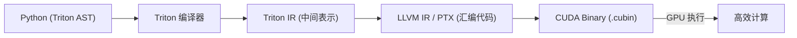
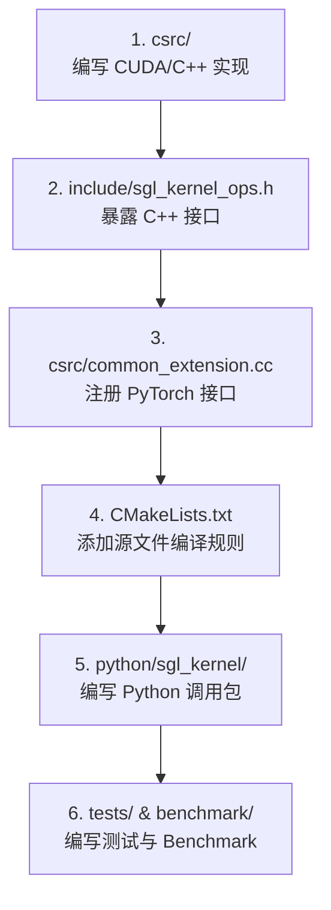

# Triton 算子开发与 sgl-kernel 核心语意库介绍 (Advanced)

> **目标**：理解 GPU 算子加速的核心思路、Triton 编译技术原理，以及 SGLang 的 C++/CUDA 核心原语库 `sgl-kernel` 的架构设计。
> **适用阶段**：Phase 2 (Week 5+) 或已具备基础 GPU 知识的进阶读者。

---

## 一、 Triton 相关的技术与设计直觉

在大语言模型（LLM）推理中，绝大部分操作都是在 GPU 上执行的。传统的算子编写有两种方式：
1. **PyTorch 纯 Python 实现**：简单好写，但在 GPU 上会触发大量的**小算子发射开销 (Kernel Launch Overhead)** 和**显存来回读写开销 (DRAM I/O Overhead)**，性能极差。
2. **CUDA C++ 原生实现**：性能极佳，但开发难度堪称恐怖，程序员必须手动管理线程块 (Thread Blocks)、线程束 (Warps)、共享内存 (Shared Memory) 分配、内存合并访问 (Coalesced Access) 以及寄存器双缓冲等硬件底层细节。

### 1.1 什么是 Triton？
**Triton** 是由 OpenAI 推出的一门开源编程语言和编译器。它允许开发者使用**类 Python** 的语法编写高性能的 GPU 算子，而底层的指令调度和内存管理由 Triton 编译器自动完成。



### 1.2 Triton 是如何做自动优化的？
Triton 核心的设计直觉是：**以“块 (Block)”为单位进行编程**。
* **在 CUDA 中**：你的代码是写给**单个线程**的，你必须计算 `threadIdx.x + blockIdx.x * blockDim.x` 这样的公式来定位当前线程读哪个数据。
* **在 Triton 中**：你的代码是写给**一个数据块 (Block)** 的。例如，你可以直接写 `x = tl.load(pointer + offset)`，其中 `offset` 是一个 `[128]` 维的张量。

Triton 编译器会自动帮你做以下三件事：
1. **内存合并访问 (Coalesced Memory Access)**：自动组织线程以确保在从全局显存 (DRAM) 读取数据时，合并多路访问，最大化带宽利用率。
2. **共享内存管理 (Shared Memory Allocation)**：自动将常用的数据块放入 GPU 的片上高速缓存 (Shared Memory/SRAM)，避免昂贵的显存重读。
3. **指令流水线化 (Instruction Pipelining)**：自动对乘加运算与数据读取进行重叠执行 (Overlap)，使得 GPU 在等待数据的同时进行计算。

### 1.3 Triton 在 SGLang 中的应用实例：Fused RMSNorm
以 [RMSNorm 的数学公式](./math-for-llm.md#math-rmsnorm) 为例：
$$
y_i = \frac{x_i}{\sqrt{\frac{1}{d} \sum_{j=1}^d x_j^2 + \epsilon}} \cdot \gamma_i
$$
如果用 PyTorch 实现，需要三步：求平方和、求均方根、点乘缩放。在 GPU 上，这会导致**数据被读写 3 次**。
而 SGLang 使用 Triton 编写的 `fused_add_rmsnorm` 算子，将输入数据只从显存读取一次，存入 GPU SRAM 中，就地完成平方和、开根号、残差相加与归一化计算，最后写回显存。这种 **Memory Fusion (算子融合)** 极大地释放了 Memory-bound 场景的性能。

---

## 二、 sgl-kernel 库架构与设计

`sgl-kernel`（前身为 `sgl-project/sgl-kernel`）是 SGLang 项目中专用的 **C++/CUDA 底层原语与算子库**。它以独立的二进制库形式存在，旨在为大模型推理提供极致的计算和通信加速。

### 2.1 为什么将 sgl-kernel 独立出来？
SGLang 项目的 Python 代码迭代极快，而 C++/CUDA 算子的编译时间较长。将 `sgl-kernel` 独立成一个包：
1. **编译隔离**：Python 层修改无需重新经历漫长的 C++/CUDA 编译（通常需 10~20 分钟），提升日常 CI/CD 的效率。
2. **模块复用**：其他推理引擎（如 vLLM 或 LightLLM）可以直接安装并使用 `sgl-kernel` 的优化算子，反之亦然。
3. **硬件解耦**：`sgl-kernel` 针对 NVIDIA (CUDA)、AMD (ROCm)、天数微导 (MUSA) 和 Apple Silicon (Metal) 进行了独立的硬件适配。

### 2.2 sgl-kernel 中有哪些关键算子？

在 [sgl-kernel/csrc/](file:///Users/stream/codes/llms/sglang/sgl-kernel/csrc) 目录下，你可以找到推理运行时最重要的加速组件：

* **FlashMLA (DeepSeek MLA 专属优化)**：
  DeepSeek 的 MLA 架构要求在运行时从压缩潜在表示中瞬时解压出 Key 和 Value。`FlashMLA` 是用 CUDA C++ 编写的专属高性能算子，优化了临时解压阶段的 SRAM 存取和 Attention 计算，是 DeepSeek 模型在 SGLang 跑出高吞吐的核心支柱。
* **AllReduce (Tensor Parallel 卡间通信优化)**：
  在多卡张量并行（TP）中，每层都要执行 All-Reduce。当使用单机 8 卡时，若直接使用 PyTorch 的 `all_reduce`，CPU 协调和底层握手开销会非常高。`sgl-kernel` 实现了自定义的物理共享内存 (Custom P2P All-Reduce) 通信，在同一机器的 NVLink 通道上实现零拷贝的多卡数据规约。
* **MoE (Mixture of Experts 专家门控)**：
  包含用于将输入 Token 快速路由分发给不同专家的 Expert Specialization 算子，以及针对稀疏 GEMM (Sparse GEMM) 优化的 Triton/CUTLASS 实现。
* **Grammar (受约束约束解码与结构化输出)**：
  当用户要求输出为 JSON 格式或符合某种 EBNF 语法规则时，SGLang 必须在每步采样前过滤 Logits（将不符合语法规则的 Token 概率置为负无穷）。`sgl-kernel` 的 `grammar` 模块将状态机转移和词法树匹配逻辑移到了 C++ 层甚至 GPU 上，大幅减少了 CPU 的判定延迟。
* **Quantization (低比特量化)**：
  支持高性能 FP8 (E4M3/E5M2)、INT8 以及最新的 FP4 混合精度矩阵乘法 (GEMM)，对接了 NVIDIA CUTLASS 库的微观流水线指令。
* **KVCacheIO (显存页拷贝)**：
  处理 PagedAttention 机制中的非连续内存页拷贝，完成从临时前向 Tensor 写入或读取 RadixCache 物理块的过程。

---

## 三、 如何向 sgl-kernel 贡献一个新算子

当你想为 SGLang 提交一个 C++/CUDA 自定义算子时，你需要遵循以下 6 步研发路径：



### 3.1 编写 PyTorch 绑定 (C++ 绑定层)
大模型在上层运行时通过 `torch.compile` 对计算图进行编译。为了兼容 PyTorch 的 JIT 与静态图机制，在 `csrc/common_extension.cc` 注册接口时，不仅要定义函数指针，还需要提供显式的 Schema。

**代码模板示例**：
```cpp
#include <torch/extension.h>
#include "sgl_kernel_ops.h"

// 1. 声明并注册 schema (torch.compile 需要它来推导静态图形状)
TORCH_LIBRARY_FRAGMENT(sgl_kernel, m) {
    m.def(
        "custom_add_norm(Tensor input, Tensor scale, Tensor! output) -> ()"
    );
    // 2. 绑定 GPU 物理执行函数
    m.impl("custom_add_norm", torch::kCUDA, &custom_add_norm_cuda_impl);
}
```

### 3.2 编写 Benchmark
为了证明你写的 Custom Kernel 比 PyTorch 默认算子或 baseline 快，你需要在 `benchmark/` 下编写性能测试。
在 `sgl-kernel` 中，**推荐使用 `triton.testing.do_bench_cudagraph`**。

**为什么比普通 `do_bench` 更好？**
* `do_bench`：只是在 Python 循环里重复启动 kernel，并用 CUDA Event 计时。这会把 **Host CPU 启动 GPU Kernel 的开销**算在内，导致小算子测不准。
* `do_bench_cudagraph`：先把你的 Kernel 录制成一个 **CUDA Graph 静态图**，直接在 GPU 内部重复回放。它消除了 CPU 发射延迟，测出的是 GPU 硬件上算子的纯粹执行时间。

---

## 💡 总结自测

1. 为什么 Triton 适合编写 Memory-bound 的算子？
2. 在 DeepSeek-V3 的推理中，`sgl-kernel` 里的 FlashMLA 算子起到了什么作用？
3. `sgl-kernel` 在 All-Reduce 通信方面做出了什么优化？为什么它能比普通多卡通信更快？
