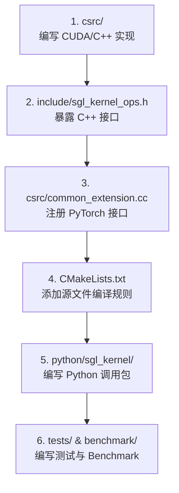

# Triton 算子开发与 sgl-kernel 核心原语库介绍 (Advanced)

> **目标**：理解 GPU 算子加速的核心思路、Triton 编译技术原理，以及 SGLang 的 C++/CUDA 核心原语库 `sgl-kernel` 的架构设计。
> **适用阶段**：Phase 2 (Week 5+) 或已具备基础 GPU 知识的进阶读者。

---

## 一、 Triton 相关的技术与设计直觉

在大语言模型（LLM）推理中，绝大部分操作都是在 GPU 上执行的。为了理清“为什么要用 Triton”，我们首先做一个三方对比。

### 1.1 三代算子开发方式对比：以向量加法 (Vector Addition) 为例

假设我们要计算两个一维数组的相加：$\mathbf{z} = \mathbf{x} + \mathbf{y}$，长度为 $N$。

#### 1. PyTorch 纯 Python 编写 (第一代)
```python
# 极简，像写数学公式一样
z = x + y
```
* **背后发生了什么**：虽然只有一行，但 PyTorch 会在 C++ 底层分配一个新的 Tensor `z` 的内存，调用一个 CUDA 加法算子，将数据从 GPU 显存读入寄存器，计算完再写回显存。
* **致命痛点（小算子堆叠）**：如果是 `out = (x + y) * w`，PyTorch 会先算 `tmp = x + y`（写回显存），再算 `out = tmp * w`（再读写一次显存）。这种**中间结果反复读写显存 (DRAM I/O Overhead)** 的现象，在深度学习中被称为“显存带宽墙”。

#### 2. 原生 CUDA C++ 编写 (第二代)
```cpp
// 必须以单个线程 (Thread) 的视角编写
__global__ void vector_add_kernel(float* x, float* y, float* z, int n) {
    // 1. 手动计算当前线程处理哪个位置的数据 (DRAM 偏移量)
    int idx = blockIdx.x * blockDim.x + threadIdx.x;
    
    // 2. 手动进行边界检查，防止越界读写
    if (idx < n) {
        z[idx] = x[idx] + y[idx];
    }
}
```
* **背后发生了什么**：程序员必须在 CPU 端指定网格尺寸 (Grid Size)、线程块大小 (Block Size)，并手动处理每一个线程的执行路径。
* **致命痛点**：如果要优化性能，程序员必须用极其晦涩的 C++ 语法去控制**共享内存拷贝、内存合并对齐、指令级并行**。一旦写错就会发生段错误 (SegFault) 或数据污染，调试周期极长。

#### 3. Triton Python 编写 (第三代)
```python
import triton
import triton.language as tl

@triton.jit
def vector_add_kernel(x_ptr, y_ptr, z_ptr, N, BLOCK_SIZE: tl.constexpr):
    # 以“数据块 (Block)”的视角进行编程！
    pid = tl.program_id(0) # 类似 CUDA 的 blockIdx.x
    
    # 计算当前块处理的索引范围 (如 0~127, 128~255)
    offsets = pid * BLOCK_SIZE + tl.arange(0, BLOCK_SIZE)
    
    # 自动生成边界掩码 (Mask)，防止越界
    mask = offsets < N
    
    # 批量加载数据、计算并写回
    x = tl.load(x_ptr + offsets, mask=mask)
    y = tl.load(y_ptr + offsets, mask=mask)
    tl.store(z_ptr + offsets, x + y, mask=mask)
```
* **背后发生了什么**：Triton 编译器会把上述 Python AST 编译为 LLVM IR，然后自动生成最适合当前 GPU 架构（如 H100 或 A100）的 GPU 汇编代码 (PTX/SASS)。

---

### 1.2 维度对比总结表

| 维度 | PyTorch 纯 Python | Triton JIT (Python) | CUDA C++ 原生 |
|---|---|---|---|
| **开发效率** | 🚀 极快 (直接调 API) | 🟡 中等 (需写 Kernel 结构) | 🐌 极慢 (需管理硬件物理细节) |
| **性能上限** | 🐌 较差 (易被 DRAM 带宽卡死) | 🚀 极佳 (逼近 CUDA 极致性能) | 🏆 完美 (理论上的硬件极限性能) |
| **显存优化** | ❌ 无法做算子融合 | 单元级融合 (DRAM 读写极少) | 手动完美融合 |
| **代码行数** | 1 行 | ~10 行 | 50+ 行 (含 CPU 启动逻辑) |
| **跨硬件移植** | 自动兼容 | 自动编译兼容 (AMD/NVIDIA/Apple) | 极难 (需重写大部分 CUDA 代码) |

---

### 1.3 核心直觉：GPU 显存层级比喻 (DRAM vs SRAM vs Registers)

为什么算子融合（如 Fused RMSNorm）能带来几倍的加速？我们用一个“生活类比”来理清 GPU 内部的显存速度差。

```
+-------------------------------------------------------------+
|                     GPU 芯片外部 (DRAM 显存)                  |
|  容量: 80 GB | 速度: 慢 (等同于网购，寄快递需要 3 天)             |
+-------------------------------------------------------------+
                              ||  搬运数据 (I/O)
                              \/
+-------------------------------------------------------------+
|                     GPU 芯片内部 (SRAM 共享内存)              |
|  容量: 几百 KB | 速度: 快 (等同于从办公桌的书架拿书，需要 10 秒)  |
+-------------------------------------------------------------+
                              ||  载入计算
                              \/
+-------------------------------------------------------------+
|                      GPU 核心内部 (Registers 寄存器)         |
|  容量: 极小 (几 KB) | 速度: 瞬间完成 (书就在手上捧着，0 秒)        |
+-------------------------------------------------------------+
```

* **未融合算子 (Unfused)**：
  计算 $z = (x + y) * w$：
  1. 从 **DRAM (快递仓库)** 读入 $x$ 和 $y$，放在 **寄存器 (手上)**，计算 $x+y$。
  2. 将结果写回 **DRAM (快递仓库)**。
  3. 再次从 **DRAM (快递仓库)** 读出刚才的结果，读入 $w$，在 **寄存器 (手上)** 计算乘法。
  4. 将最终结果写回 **DRAM (快递仓库)**。
  * *一共邮寄了 2 次快递，GPU 大部分时间在等快递小哥。*

* **融合算子 (Fused)**：
  1. 从 **DRAM (快递仓库)** 一次性读入 $x, y, w$。
  2. 在 **寄存器 (手上)** 算出 $x+y$，**不放手**，立刻乘以 $w$。
  3. 将最终结果写回 **DRAM (快递仓库)**。
  * *只邮寄了 1 次快递。Triton 编译器最擅长的就是自动帮你规划“手里的数据别放下”，最大化减少向 DRAM 发送快递的次数。*

### 1.4 RAM 家族全景：从 SRAM 到 HBM

上一节从 GPU 内部视角讲了 DRAM/SRAM/Registers 的速度差异。这里从硬件全局视角，梳理所有常见 RAM 类型及其在 AI 系统中的位置。

#### 两大基础类型

| 类型 | 存储原理 | 访问延迟 | 密度 | 成本 | 是否需要刷新 |
|------|---------|---------|------|------|------------|
| **SRAM** (Static RAM) | 6 个晶体管构成一个锁存器 | ~1 ns | 低 | 极贵 | 不需要 |
| **DRAM** (Dynamic RAM) | 1 个晶体管 + 1 个电容 | ~50-100 ns | 高 | 便宜 | 需要（电容漏电） |

**为什么叫 Dynamic？** 因为电容会漏电，必须每隔几毫秒刷新一次（重新充电），否则数据丢失。SRAM 用晶体管互锁，通电就不丢。

#### DRAM 的演进分支

```
DRAM
 ├── SDRAM（同步 DRAM，与时钟同步传输）
 │    └── DDR SDRAM（双倍数据率，上升沿+下降沿都传数据）
 │         ├── DDR4 → DDR5（PC 内存条）
 │         └── LPDDR5/LPDDR5x（低功耗版，手机 & Apple Silicon 统一内存）
 ├── GDDR6/GDDR7（为 GPU 优化，带宽高，延迟略大）
 └── HBM / HBM2e / HBM3 / HBM3e（垂直堆叠 + TSV 互联，带宽极高）
```

#### 各 RAM 类型在 AI 系统中的位置

| RAM 类型 | 带宽 | 容量 | 用在哪里 | 代表产品 |
|---------|------|------|---------|---------|
| SRAM | 极高（TB/s 级） | 极小（几百 KB~几十 MB） | CPU L1/L2/L3 缓存、GPU Shared Memory & 寄存器文件 | — |
| DDR5 | ~50 GB/s | 16~512 GB | CPU 主存 | 服务器内存条 |
| LPDDR5x | ~100 GB/s | 8~192 GB | Apple Silicon 统一内存、手机 | M3 Pro 36GB |
| GDDR6X | ~1 TB/s | 12~24 GB | 消费级 GPU 显存 | RTX 4090 |
| HBM3e | ~5 TB/s | 80~192 GB | 数据中心 GPU 显存 | H100 (80GB)、H200 (141GB) |

#### 为什么 HBM 这么快？

传统 GDDR 是芯片旁边"平铺"的颗粒，靠 PCB 走线连到 GPU，总线位宽有限。HBM 把多层 DRAM die 垂直堆叠（像千层饼），层间用 TSV（硅通孔）互联，然后通过硅中介层（interposer）紧贴 GPU die。这样：
- 总线位宽极大（HBM3 一个 stack 就有 1024-bit）
- 物理距离极短（微米级而非厘米级）
- 代价：制造工艺复杂、良率低、价格贵

#### 与算子融合的关系

回到 1.3 节的核心结论：

- **GPU 的计算速度远快于显存带宽**（称为 memory-bound）
- HBM3e 已经是 5 TB/s 了，但 GPU 的算力可能需要 50 TB/s 的喂数据速度
- 算子融合的本质：让中间结果留在 SRAM（Shared Memory / 寄存器），不回到 HBM
- 这就是为什么 FlashAttention、Fused RMSNorm 等融合算子能带来数倍加速——它们把 HBM 访问次数从 O(N²) 降到 O(N)

---

## 二、 sgl-kernel 库架构与设计

`sgl-kernel` 是 SGLang 项目中专用的 **C++/CUDA 底层原语与算子库**。为了让大家明白它与通用算子库的区别，我们再做一次定位对比。

### 2.1 算子库定位对比：`sgl-kernel` 解决了什么

| 算子库 | 代表 | 核心特征 | 在 SGLang 中的角色 |
|---|---|---|---|
| **通用数学计算库** | cuBLAS, PyTorch | 追求普适性，支持各种矩阵 Shape 和维度 | 提供基础矩阵乘法和常规层计算 |
| **大模型通用加速库** | FlashAttention, FlashInfer | 专门优化标准 Attention 机制的计算 | 被 SGLang 封装作为 Attention 底层后端 |
| **推理引擎特化原语库** | **`sgl-kernel`** | **针对特定模型（如 DeepSeek-V3）与特定 Serving 特征（如约束语法过滤）进行硬核定制** | SGLang 核心竞争力的硬件级加速源泉 |

---

### 2.2 sgl-kernel 关键特化算子的深入理解

#### 1. FlashMLA —— 降维解压的“极速解密器”
* **对比**：普通的 Attention 算子（如标准 FlashAttention）在推理时，要求 KV Cache 必须是解压好的明文张量 `[B, L, H, D]`。
* **FlashMLA 的做法**：直接读取 DeepSeek 潜在压缩向量 $\mathbf{c}_t^{KV} \in \mathbb{R}^{d_c}$，在 GPU 片上高速缓存 (SRAM) 内**就地解压**并完成 Attention 点积，计算完后立刻丢弃解压数据。这种“按需瞬时解压”的 CUDA 算子，彻底释放了 DeepSeek-V3 的长文本吞吐潜力。

#### 2. P2P AllReduce —— 八人小组的“传声筒”
* **对比**：标准的 PyTorch `all_reduce` 在多卡同步时，数据需要经过 CPU 的同步调度协调（Host-Device 握手开销），或通过网络栈传递。
* **sgl-kernel 的做法**：直接调用 NVLink 的 P2P (Peer-to-Peer) 物理通道，8 张 GPU 的显存直接互相映射。GPU 0 在算完的一瞬间，可以通过硬件直接写到 GPU 1 的显存特定区域，省去了中间的所有软件调度栈。

#### 3. Constrained Grammar —— 词法状态机的“硬件级过滤器”
* **对比**：普通的 JSON/EBNF 约束解码在每步生成时，由 Python 在 CPU 端运行正则表达式匹配，挑选出合法的 Token 列表，再把过滤矩阵拷给 GPU。这导致 CPU 成为严重瓶颈，GPU 被迫“空转等待”。
* **sgl-kernel 的做法**：把前缀树（Trie 树）、有限状态自动机 (FSA) 全部用 C++ 甚至 CUDA 算子实现。GPU 算完 Logits 后，直接在显存内完成语法状态转移和 Logits 过滤，免去了 CPU-GPU 来回拷贝数据的严重延迟。

---

## 三、 如何向 sgl-kernel 贡献一个新算子

当你想为 SGLang 提交一个 C++/CUDA 自定义算子时，你需要遵循以下 6 步研发路径：



### 3.1 编写 PyTorch 绑定 (C++ 绑定层)
大模型在上层运行时通过 `torch.compile` 对计算图进行编译。为了兼容 PyTorch 的 JIT 与静态图机制，在 `csrc/common_extension.cc` 注册接口时，不仅要定义函数指针，还需要提供显式的 Schema。

**代码模板示例**：
```cpp
#include <torch/extension.h>
#include "sgl_kernel_ops.h"

// 1. 声明并注册 schema (torch.compile 需要它来推导静态图形状)
TORCH_LIBRARY_FRAGMENT(sgl_kernel, m) {
    m.def(
        "custom_add_norm(Tensor input, Tensor scale, Tensor! output) -> ()"
    );
    // 2. 绑定 GPU 物理执行函数
    m.impl("custom_add_norm", torch::kCUDA, &custom_add_norm_cuda_impl);
}
```

### 3.2 编写 Benchmark
为了证明你写的 Custom Kernel 比 PyTorch 默认算子或 baseline 快，你需要在 `benchmark/` 下编写性能测试。
在 `sgl-kernel` 中，**推荐使用 `triton.testing.do_bench_cudagraph`**。

**为什么比普通 `do_bench` 更好？**
* `do_bench`：只是在 Python 循环里重复启动 kernel，并用 CUDA Event 计时。这会把 **Host CPU 启动 GPU Kernel 的开销**算在内，导致小算子测不准。
* `do_bench_cudagraph`：先把你的 Kernel 录制成一个 **CUDA Graph 静态图**，直接在 GPU 内部重复回放。它消除了 CPU 发射延迟，测出的是 GPU 硬件上算子的纯粹执行时间。

---

## 💡 总结自测

1. 为什么说 PyTorch 默认的 `out = (x + y) * w` 存在显存带宽瓶颈？Triton 是如何利用 GPU 显存层级进行优化的？
2. 在 DeepSeek-V3 的推理中，`sgl-kernel` 里的 FlashMLA 算子起到了什么作用？它是怎么节省显存带宽的？
3. sgl-kernel 里的 AllReduce 相比普通通信，为什么能跑出更低的延迟？
4. 约束解码（Grammar）在 SGLang 中为什么要被下沉到 C++ 甚至 CUDA 层实现？
