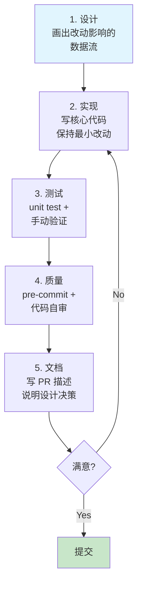
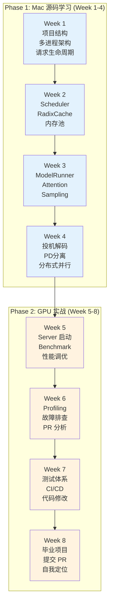
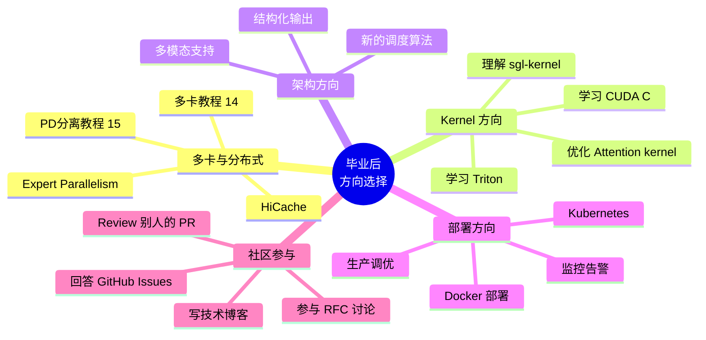

# Week 8: 综合项目与毕业

> **阶段**: Phase 2 — GPU 实战 (最后一周)
> **预计用时**: 10 小时 (5 天 × 2h)
> **前提**: 完成 Week 7 (能写测试、跑 CI、提交代码)
> **环境**: NVIDIA GPU

---

## 学习目标

```
Week 7: 你学会了测试和提交流程
Week 8: 你要独立完成一个完整特性，证明自己能上手干活
```

本周结束后你应该能：
1. 独立完成一个小特性的设计、实现、测试
2. 写一个合格的 PR
3. 清晰地自评自己在 SGLang 生态中的定位
4. 知道下一步往哪个方向深入

---

## Day 1-3: 毕业项目 (6h)

### 选题

从以下选题中选一个。每个选题标注了难度和涉及的组件，选择你最有信心的方向。

#### Level 1: 添加一个 Server Metrics 指标 (推荐新手)

**目标**: 给 SGLang Server 添加一个新的监控指标

**示例**: 添加「平均请求排队等待时间」指标

**涉及组件**: Scheduler, HTTP Server

**步骤提示**:
1. 在 Scheduler 中记录每个请求进入等待队列的时间
2. 请求开始执行时计算等待时间
3. 通过 metrics 端点暴露平均等待时间
4. 编写测试验证指标正确性

**关键文件**:
- `python/sglang/srt/managers/scheduler.py` — Scheduler 主循环
- `python/sglang/srt/managers/io_struct.py` — 请求数据结构

#### Level 2: 实现一个自定义 Logits Processor (中等)

**目标**: 实现一个自定义的 logits 处理器

**示例**: 实现一个「禁止重复 n-gram」处理器

**涉及组件**: Sampling, ModelRunner

**步骤提示**:
1. 理解现有 sampling pipeline (回忆 Week 3 Day 4)
2. 在 sampling 流程中找到 logits processor 的注册位置
3. 实现 no-repeat-ngram 逻辑
4. 编写测试：验证输出不包含重复的 n-gram

**关键文件**:
- `python/sglang/srt/sampling/` — 采样相关代码

#### Level 3: 给 RadixCache 添加统计信息 (进阶)

**目标**: 让 RadixCache 能汇报自身的使用统计

**示例**: Cache 命中率、平均前缀长度、节点数量

**涉及组件**: RadixCache, Scheduler

**步骤提示**:
1. 回忆 Week 2 的 RadixCache 原理
2. 在 `match_prefix()` 中统计命中/未命中次数
3. 计算命中率、平均命中前缀长度
4. 通过 Server API 暴露统计信息
5. 编写测试：构造有共享前缀的请求，验证命中率

**关键文件**:
- `python/sglang/srt/mem_cache/radix_cache.py` — RadixCache 实现

### 项目执行流程

无论选哪个题目，都按这个流程执行：



### 设计阶段模板

在动手写代码之前，先回答这些问题：

```markdown
## 我的毕业项目设计

### 选题: [你选的题目]

### 改动范围
- 需要修改的文件: ___
- 需要新增的文件: ___
- 不需要改的文件: ___

### 数据流变化
- 原来的数据流: A → B → C
- 改后的数据流: A → B' → C (B' 新增了 xxx)

### 测试计划
- 测试 1: 验证 ___
- 测试 2: 验证 ___

### 预估时间
- 实现: __h
- 测试: __h
- 调试: __h
```

---

## Day 4: 提交你的第一个 PR (2h)

### 4.1 PR 的写法

一个好的 PR 包含：

```markdown
## Summary

[1-3 句话描述改了什么和为什么]

## Changes

- [改动 1]
- [改动 2]
- [改动 3]

## Test Plan

- [ ] 单元测试通过: `python3 test/xxx.py`
- [ ] 本地 Server 测试通过
- [ ] pre-commit 通过

## Related Issues

Closes #xxx (如果有相关 issue)
```

### 4.2 提交流程

```bash
# 确保在你的 feature 分支上
git checkout my-capstone-project

# 确保代码格式正确
pre-commit run --files path/to/your/files.py

# 运行测试
python3 test/registered/unit/your_test.py

# 提交
git add -A
git commit -m "[Feature] Add average queue wait time metric"

# Push 到你的 fork
git push myfork my-capstone-project

# 在 GitHub 上创建 PR
# 或用 gh CLI:
gh pr create --title "[Feature] Add average queue wait time metric" \
    --body "$(cat <<'EOF'
## Summary
Add a new metric that tracks the average time requests spend waiting in the scheduler queue.

## Changes
- Added queue entry timestamp to Req dataclass
- Compute wait time when request starts execution
- Expose average_queue_wait_ms via server info endpoint

## Test Plan
- [ ] Unit test: test_queue_wait_metric passes
- [ ] Manual test: metric correctly reflects queue delay under load
EOF
)"
```

### 4.3 应对 Code Review

收到 review 意见后：

1. **仔细阅读每条评论** — 即使你不同意，也要理解 reviewer 的角度
2. **及时回复** — 说明你是否同意，以及你的理由
3. **批量修改** — 不要一条一条改，攒一批一起改
4. **更新 PR** — Push 新 commit，不要 force push

```bash
# 根据 review 修改后
git add -A
git commit -m "Address review: rename metric to queue_delay_avg_ms"
git push myfork my-capstone-project
```

### 4.4 CI 失败排查

```bash
# 如果 PR 的 CI 失败了

# 1. 看 GitHub Actions 的日志，找到具体失败的 test
# 2. 在本地复现
python3 test/registered/xxx/failing_test.py

# 3. 常见失败原因
# - import 错误: 新文件没有被正确导入
# - 格式错误: pre-commit 没跑
# - 测试超时: GPU 测试在 CI 的较弱 GPU 上可能更慢
# - 非确定性: 随机采样导致偶发失败
```

---

## Day 5: 回顾与自评 (2h)

### 5.1 八周知识图谱



### 5.2 自评矩阵

诚实地评估自己在每个维度的水平：

| 维度 | 初级 | 中级 | 高级 | 专家 |
|------|------|------|------|------|
| **架构理解** | 知道有哪些组件 | 能画出数据流 | 能解释设计决策的 trade-off | 能提出架构改进方案 |
| **源码阅读** | 能找到入口 | 能跟踪请求生命周期 | 能独立分析一个 PR | 能发现代码中的潜在问题 |
| **性能理解** | 知道 Prefill/Decode 区别 | 能做纸面计算 | 能用 Profiler 定位瓶颈 | 能提出优化方案 |
| **测试能力** | 能运行测试 | 能写单元测试 | 能写集成测试 | 能设计测试策略 |
| **贡献能力** | 能提文档 PR | 能修小 bug | 能做 feature | 能做架构级改动 |

**8 周后的合理期望**: 大部分维度达到「中级」，1-2 个擅长方向达到「高级」。

### 5.3 持续成长路线图

**高级教程** (已有配套文档，毕业后直接学习):
- [多卡分布式推理 (TP/DP/DPA/EP)](../03-advanced/multi-gpu.md) — 需要 2+ 张 GPU
- [PD 分离部署](../03-advanced/pd-disaggregation.md) — 需要多卡 + RDMA 网络



### 5.4 推荐的下一步

1. **持续关注**: Watch SGLang 仓库，阅读新 PR
2. **每周贡献**: 保持每周至少读 2-3 个 PR，提 1 个小 PR
3. **深入一个方向**: 选一个你最感兴趣的方向，深入学习
4. **社区参与**: 加入 SGLang 社区讨论，回答新人的问题

---

## 毕业清单

完成以下所有项目，恭喜你毕业：

### Phase 1 检验 (Week 1-4)
- [ ] 能从零画出 SGLang 架构图 (5 个组件 + 数据流)
- [ ] 能解释 RadixCache 的工作原理和 LRU 淘汰
- [ ] 能描述一个请求从 HTTP 到返回的完整生命周期
- [ ] 能解释 Prefill vs Decode 的性能差异

### Phase 2 检验 (Week 5-8)
- [ ] 在 GPU 上成功启动过 SGLang Server
- [ ] 运行过 benchmark 并理解 TTFT/TPS 的含义
- [ ] 用 Profiler 看过 GPU trace
- [ ] 在 GPU 上运行过至少 3 个测试
- [ ] 完成过至少一次 branch → commit → (optional: PR) 的完整流程
- [ ] 完成了毕业项目

---

> 恭喜完成 8 周学习！从阅读源码到独立贡献，你已经具备了参与 SGLang 开发的能力。
> 持续实践是最好的老师 — 继续阅读 PR、提交代码、参与讨论。
