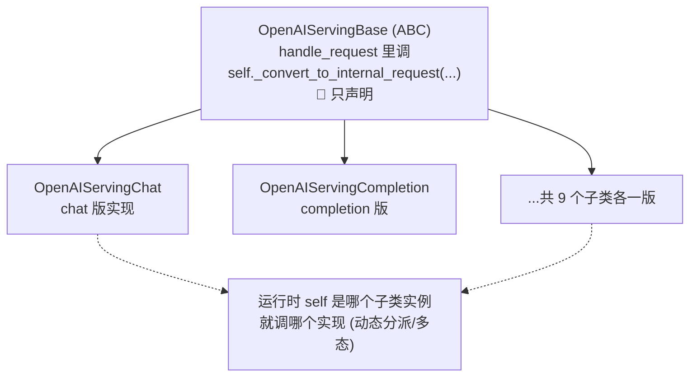

# 如何找抽象方法(ABC / @abstractmethod)的具体实现

> **记录日期**: 2026-06-18
> **触发场景**: 跳到 `OpenAIServingBase._convert_to_internal_request`,发现是抽象方法,看不到具体实现,不知道运行时到底跑哪段。
> **一句话结论**: 抽象方法在基类里**只声明不实现**,实现散在**子类**。最快找法:命令行 `grep -rn "def 方法名"`,或 IDE 的 **"Go to Implementations"**(不是 Definition)。运行时调哪个由 `self` 的真实子类决定(多态)。

---

## 为什么基类里找不到实现:多态

```python
# serving_base.py:164  —— 基类只定契约
from abc import ABC, abstractmethod
class OpenAIServingBase(ABC):
    @abstractmethod
    def _convert_to_internal_request(self, request, raw_request=None):
        """Convert OpenAI request to internal format"""
        pass     # ← 没有实现,逼子类必须实现
```



> 基类那行 `self._convert_to_internal_request(...)` 写代码时**根本不知道会调到哪个**——取决于运行时 `self` 的真实类型。所以要去**子类**找实现。同理于 `RayEngine(Engine)`:基类定骨架,子类填实现。

---

## 找实现的 4 种方法(从快到准)

### ① grep `def 方法名`(命令行首选)⭐
```bash
grep -rn "def _convert_to_internal_request" python/sglang/srt/
```
> 抽象方法是声明,实现都是 `def` 出来的。列出来的(除基类那个带 `@abstractmethod` 的)全是实现。

### ② 先找谁继承了基类,再去对应文件看
```bash
grep -rn "OpenAIServingBase)" python/sglang/srt/entrypoints/openai/
```

### ③ IDE「跳转到实现」(不是「跳转到定义」)
| IDE | 操作 |
|-----|------|
| **VS Code** | 右键 → **Go to Implementations**(`Ctrl/Cmd + F12`)。`Go to Definition` 只跳到抽象声明,要点 **Implementations** 才列所有子类实现 |
| **PyCharm** | 右键 → **Go To → Implementation(s)**(`Ctrl/Cmd + Alt + B`);基类方法左侧栏有 ⬇️ 图标,点它直接列实现 |

> 日常最该用这个——直接弹出所有实现列表。

### ④ 看 `@abstractmethod` 确认它是抽象的
看到方法上方有 `@abstractmethod`、函数体是 `pass` / `...` / `raise NotImplementedError` = "这里没实现,去子类找"的明确信号。子类不实现它连实例化都会报错。

---

## 确认运行时到底走哪个实现
```python
print(type(self).__name__)   # 在基类调用处打印 → 例如 OpenAIServingChat,即真实子类
# 或: 在基类 handle_request 调用处下断点, step into 会进入真正的子类实现
```

---

## 本例结论

`_convert_to_internal_request` 的实现按 API 类型分散在 9 个子类:

| API | 子类 | 位置 |
|-----|------|------|
| `/v1/chat/completions` | `OpenAIServingChat` | `serving_chat.py:456` ← chat 请求实际走这 |
| `/v1/completions` | `OpenAIServingCompletion` | `serving_completions.py:65` |
| embeddings / classify / rerank / score / tokenize / detokenize / transcription | 各子类 | 同名文件 |

> 路由层 `app.state.openai_serving_chat` 是 `OpenAIServingChat` 实例,故 chat 请求的 `self._convert_to_internal_request` 绑到 `serving_chat.py:456`。串联请求链路见 [[2026-06-18-sglang-chat-request-entry]](如已记)。

---

## 一句话回顾

> 抽象方法实现在子类。命令行 `grep "def 方法名"`、IDE「Go to **Implementations**」最快;`@abstractmethod` 是"去子类找"的标志;`type(self).__name__` 确认运行时实际类型。
