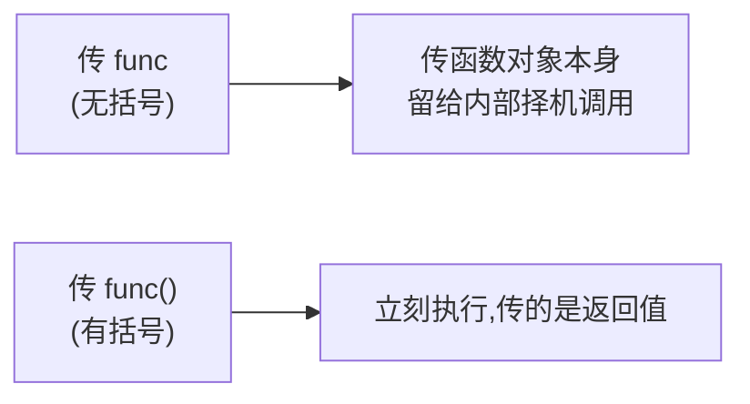
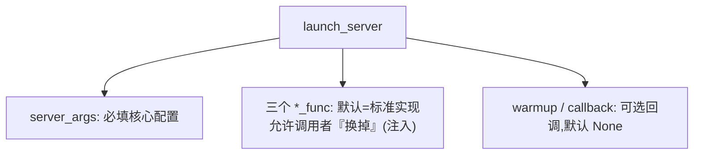

# Python 函数签名语法(类型注解 / Callable / 依赖注入)对比 Java

> **记录日期**: 2026-06-18
> **触发场景**: 读 `launch_server(...)` 的函数签名,一堆 `: Callable`、`Optional`、`= 某函数` 看不懂。
> **一句话结论**: 这是「类型注解 + 默认参数 + 把函数当值传」的组合,本质是**依赖注入**——核心配置必填,各执行步骤可被替换,默认用标准实现。注解仅是提示,运行时不强制(和 Java 强类型不同)。

---

## 原代码

```python
def launch_server(
    server_args: ServerArgs,                                        # 必填,带类型注解
    init_tokenizer_manager_func: Callable = init_tokenizer_manager, # 默认值是「函数本身」
    run_scheduler_process_func: Callable = run_scheduler_process,
    run_detokenizer_process_func: Callable = run_detokenizer_process,
    execute_warmup_func: Optional[Callable] = None,                 # 可选,默认 None
    launch_callback: Optional[Callable[[], None]] = None,           # 无参无返回的函数
):
```

---

## 五个语法点

| 写法 | 含义 |
|------|------|
| `server_args: ServerArgs` | **类型注解**,且无 `=` 默认值 → **必填**。注解仅提示,运行时不检查 |
| `xxx = init_tokenizer_manager` | **默认参数**,默认值是**函数本身**（注意没有 `()`） |
| `: Callable` | 参数是「可调用对象」（函数 / lambda / 带 `__call__` 的对象） |
| `Optional[Callable]` | = `Callable 或 None`，配合 `= None` 表示「可选回调」 |
| `Callable[[], None]` | 精确描述：**不收参数、无返回值**的函数。格式 `Callable[[参数类型], 返回类型]` |

**最关键的坑**——函数带不带括号:

```python
init_tokenizer_manager      # 函数本身,传递它(像传一个『工具』)
init_tokenizer_manager()    # 立刻调用,拿返回值
```



`Callable[...]` 速记：

| 写法 | 含义 |
|------|------|
| `Callable` | 随便什么函数 |
| `Callable[[], None]` | 不收参数、无返回值 |
| `Callable[[int, str], bool]` | 收 int+str、返回 bool |

---

## 对比 Java

| 维度 | Python | Java |
|------|--------|------|
| 类型检查 | 注解仅**提示**,运行时不强制(传错类型不报错) | **编译期强制**,类型不符直接编译失败 |
| "函数当参数" | 函数是一等公民,直接传 `func`(无括号) | 没有裸函数,要用**函数式接口** `Runnable` / `Supplier<T>` / `Function<A,B>` 或方法引用 `this::foo` |
| `Callable[[], None]` | 无参无返回的函数 | 约等于 `Runnable`(`void run()`) |
| `Callable[[int],bool]` | | 约等于 `Function<Integer,Boolean>` |
| `Optional[X] = None` | 可空 + 默认值,一行搞定 | `X` 可为 null（无默认参数语法）;`java.util.Optional<X>` 是另一回事(防 NPE 容器,不能做默认值) |
| 默认参数 | 原生支持 `def f(x=10)` | **不支持**,只能靠**方法重载**模拟 |

> 一句话:Python 一行 `func: Callable = default_func` 在 Java 里要拆成「函数式接口类型 + 方法引用 + 重载出一个无参版本」三件事。

```java
// Java 近似等价:依赖注入一个『无参无返回』的回调
void launchServer(ServerArgs args, Runnable launchCallback) { ... }
void launchServer(ServerArgs args) { launchServer(args, () -> {}); }  // 重载模拟默认值

launchServer(args, () -> System.out.println("起来了"));  // 方法引用/lambda 传入
```

---

## 为什么这么设计:依赖注入



平时用默认标准实现;**测试/定制**时传入自己的版本替换——比如测试传个假的 `run_scheduler_process_func` 来 mock 掉真实进程启动。这就是 Python 风格的**依赖注入**(Java 里常靠 Spring/构造器注入接口实现同样目的)。

```python
launch_server(server_args)                                  # 全用默认
launch_server(server_args,
    run_scheduler_process_func=my_fake_scheduler,           # 关键字传参,换掉默认
    launch_callback=lambda: print("server 起来了"))          # 传无参无返回的函数
```

---

## 一句话回顾

> `: 类型`=注解(只提示)、`=`=默认参数、默认值写**函数名不带括号**=把函数当值传、`Callable[[], None]`=无参无返回的函数、`Optional[X]=None`=可选。组合起来是**依赖注入**。Java 里同样的事要靠「函数式接口 + 方法引用 + 重载」三件套。

延伸：[`self` / `cls` 对比 Java `this` / 工厂模式](./2026-06-21-python-self-cls-vs-java-this-factory.md) · [对象怎么初始化](./2026-06-18-python-init-explained.md) · [引用语义对比 Java](./2026-06-18-python-vs-java-object-reference.md)
