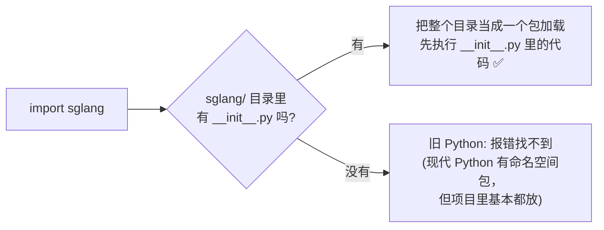
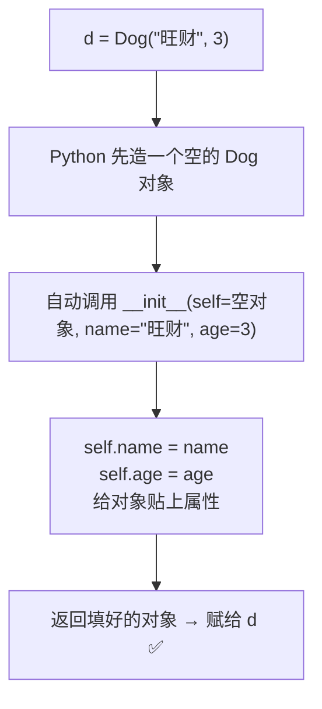
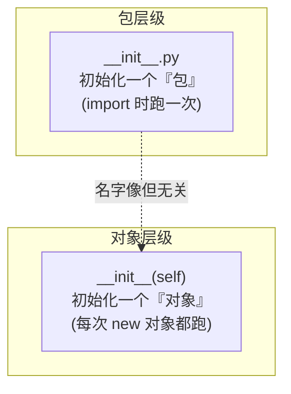

# Python 的两个 `__init__` 到底是干啥的

> **记录日期**: 2026-06-18
> **触发场景**: 在 SGLang 源码里到处看到 `__init__`，分不清文件级的 `__init__.py` 和类里的 `def __init__(self)`。
> **一句话结论**: 名字像，但完全是两个东西——一个标记「文件夹是包」，一个是「对象的初始化器」。两个都是 "initialize" 的缩写。

---

## 先记口诀

> - 看到**文件** `__init__.py` → 包（package）的标志 + 入口门面，`import` 时**执行一次**。
> - 看到**方法** `def __init__(self, ...)` → 对象的初始化器，**每次造对象都跑**。

两边名字前后都有双下划线 `__`，叫 **dunder（double underscore）**，是 Python 约定的「特殊/魔术」名字，会在特定时机被**自动调用**。

---

## ① `__init__.py` —— 文件，"这个文件夹是一个包"的标志

作用：**告诉 Python「这个目录是一个可以被 import 的包」**。

```
python/
└── sglang/
    ├── __init__.py   ← 有它，sglang 才能被 import
    ├── srt/
    │   └── __init__.py
    └── ...
```



它做两件事：

1. **当标志位**：有它，`sglang` 才是一个正经的包。
2. **当"门面"**：`import sglang` 时，会**先把 `__init__.py` 整个执行一遍**。所以库作者常在里面把深层 API「提」到顶层：

```python
# sglang/__init__.py 里常见写法
from sglang.api import gen, system, user      # 把深层的东西"提"到顶层
__version__ = "0.4.x"

# 效果：用户可以直接写 sglang.gen(...)
#       而不用写 sglang.api.gen(...)
```

> 一句话：`__init__.py` 是**包级别**的初始化 + 入口门面。

---

## ② `__init__(self, ...)` —— 方法，对象的"构造/初始化器"

类里的特殊方法。**每次创建对象时，Python 自动调用它**，用来给新对象设置初始属性。其他语言里常叫"构造函数"。

```python
class Dog:
    def __init__(self, name, age):   # ← 创建对象时自动跑
        self.name = name             # 把传进来的值，存到这个对象身上
        self.age = age

d = Dog("旺财", 3)   # 这一行：先造出空对象，再自动调用 __init__ 填值
print(d.name)        # 旺财
```



关键点：

| 概念 | 说明 |
|------|------|
| `self` | 指**正在被创建的那个对象自己**，Python 自动传，你不用手写 |
| 自动调用 | 你写 `Dog(...)`，`__init__` 自己就跑了，不用 `d.__init__()` |
| 不是真构造函数 | 严格说对象在 `__init__` 之前已由 `__new__` 造好，`__init__` 只负责**初始化填值**。日常理解成"构造函数"够用 |
| 没写会怎样 | 不写也行，对象能创建，只是没有初始属性 |

---

## 为什么都叫 `__init__`？

两个 `init` 都是 "**initialize（初始化）**" 的意思，只是层级不同：



---

## 在 SGLang 里

你会**大量**见到第二种 `def __init__(self, ...)`，尤其是几个核心大类：

- `Scheduler.__init__`（`python/sglang/srt/managers/scheduler.py`）
- `TokenizerManager.__init__`（`python/sglang/srt/managers/tokenizer_manager.py`）
- `ModelRunner.__init__`（`python/sglang/srt/model_executor/model_runner.py`）

> ⚠️ 这三个类的 `__init__` 又长又关键，项目里专门有规范约束改它们时的写法
> （参见 `.claude/skills/large-class-init-style/`）。改这些构造逻辑前先读那份 skill。

第一种 `__init__.py` 则散落在每个包目录下，最值得看的是顶层
`python/sglang/__init__.py`——它定义了 `import sglang` 后你能直接用到哪些东西。
