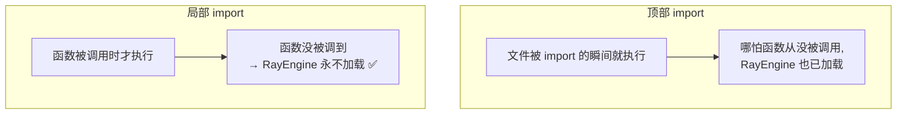
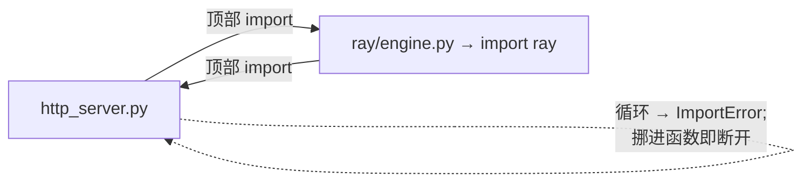

# 局部 import(函数内导入 / lazy import)

> **记录日期**: 2026-06-18
> **触发场景**: 在 `ray/http_server.py` 里看到 `import` 写在函数**内部**(`from ...ray.engine import RayEngine`),不是文件顶部。
> **一句话结论**: 把 import 写在函数里 = **延迟到函数被调用时才加载**。最常见的两个理由:① 避免拉进**可选的重依赖**(如 Ray);② 打破**循环 import**。

---

## 顶部 import vs 局部 import

```python
# ① 顶部(模块级):文件被加载时就执行,全文件可用
from sglang.srt.ray.engine import RayEngine
def launch_server(...):
    engine = RayEngine(...)

# ② 局部(函数内):只在函数被调用时执行,只在函数内可见
def launch_server(...):
    from sglang.srt.ray.engine import RayEngine   # ← 调用时才 import
    engine = RayEngine(...)
```



---

## 为什么这么写

| 原因 | 说明 |
|------|------|
| ⭐ **可选重依赖** | `RayEngine` 会 `import ray`,而 **Ray 是可选大依赖**(很多用户没装)。放顶部 → 只要文件被 import 就连带 `import ray` → 没装的用户直接 `ModuleNotFoundError`。放函数内 → 只有真用 Ray 启动的人才触发,其余人不受影响 |
| **打破循环 import** | A 顶部 import B、B 顶部又 import A → Python 加载时死循环报错。把一个 import 挪进函数(延迟到运行时)即可断环。本例从同名 `http_server` 互引 `_execute_server_warmup` 等,也是这个考量 |
| 加快启动 / 省内存 | 不常用的重模块用到才加载,启动更快 |



> 同思路:之前看的插件机制里 `_get_excluded_dists`「避免 import 没在用的硬件包」也是**按需加载,别让可选依赖污染主路径**。见 [[2026-06-18-sglang-plugins-and-entry-points]]。

---

## 代价(所以默认还是放顶部)

| | 顶部 import | 局部 import |
|---|---|---|
| 依赖问题暴露 | 启动即报错(早发现) | 调用时才报错(晚发现) |
| 每次调用开销 | 一次性 | 每次查一次缓存(极小) |
| 可读性 | 依赖一目了然 | 藏在函数里 |
| 适用 | **默认首选**(PEP 8 推荐) | 可选/重依赖、循环 import、极少用分支 |

> 局部 import 是「**有理由才用**」的例外,理由通常就是上面两条。

---

## 验证它确实按需

```python
import sys
print("ray" in sys.modules)   # 调用前: False
launch_server(...)            # 内部触发 from ...ray.engine import ...
print("ray" in sys.modules)   # 调用后: True ← 这时 ray 才被加载
```

---

## 一句话回顾

> import 写进函数 = 延迟到调用时加载。这里是为了让没装 **Ray** 的用户不被强制 import 它,同时规避 `http_server` 的**循环 import**。代价是依赖问题运行时才暴露,故默认仍把 import 放顶部。
