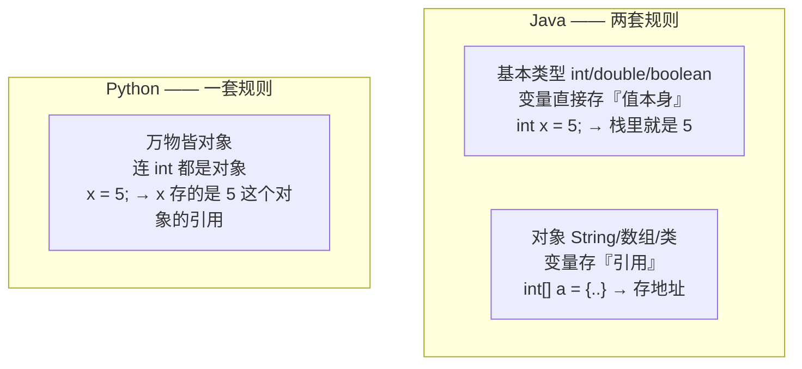
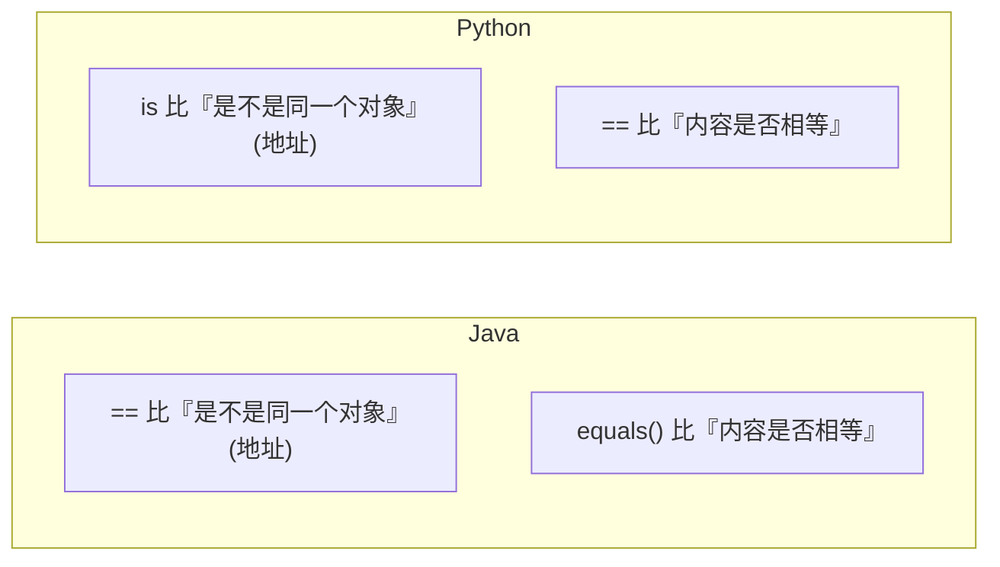
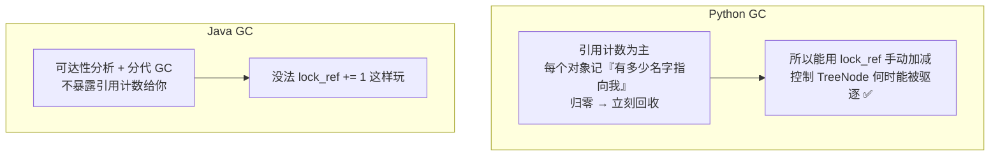

# Python 的对象引用 vs Java —— 像,但有三个坑

> **记录日期**: 2026-06-18
> **触发场景**: 看 `prerequisites.md` 的「1.8 Python 中的对象引用」,联想到这跟 Java 是不是一回事(为了看懂 RadixCache 的 `lock_ref`)。
> **一句话结论**: 引用语义上 Python ≈ Java(变量都是指向对象的引用,`b=a` 不复制对象),但有三个差异搞混了会踩坑。

---

## 相同的地方(直觉是对的)✅

两者都是「**变量存的是引用/地址,不是对象本身**」,`b = a` 不复制对象,只是多一个名字指向同一块内存。

```java
// Java
int[] a = {1, 2, 3};
int[] b = a;        // b 和 a 指向同一个数组
b[0] = 99;
System.out.println(a[0]);  // 99 ← a 也变了
```

```python
# Python
a = [1, 2, 3]
b = a               # b 和 a 指向同一个 list
b[0] = 99
print(a[0])         # 99 ← a 也变了
```

```
名字            对象(内存)
 a ─┐
    ├──────►  [1, 2, 3]      b = a 之后,两个名字
 b ─┘                         指向同一块内存
```

---

## 差异 1:Java 区分「基本类型 vs 对象」,Python 不区分

最大的区别。



- Java:`int x = 5` 时,`x` **里装的就是 5**(基本类型直接存值)。
- Python:`x = 5` 时,`x` 装的是**指向 `5` 这个整数对象的引用**。Python **没有"基本类型"**,数字、布尔值全是对象。

> 因为数字不可变,实践影响不大,但理解模型不同。

---

## 差异 2:可变 vs 不可变,决定「改动会不会互相影响」

Python 比 Java 更需要警惕,因为它影响函数传参行为。

| | 不可变(int, str, tuple) | 可变(list, dict, set, 自定义对象) |
|---|---|---|
| `b = a; b = 新值` | a 不变(b 改指向新对象) | a 不变(同理) |
| `b = a; b.改内容()` | 不存在这种操作 | **a 也变**(同一对象) |

```python
a = [1, 2, 3]
b = a
b = [9, 9]      # 重新赋值 → b 指向新 list,a 还是 [1,2,3] ✅ 不影响
b.append(4)     # 但如果是 b.append → 改的是同一个对象,a 也变

a = "hi"
b = a
b += "!"        # str 不可变 → 生成新字符串,a 还是 "hi"
```

> **口诀**:重新赋值(`=`)永远是「改名字指向」,不影响别人;
> 原地修改(`.append` / `[0]=` / `.attr=`)才会影响所有指向它的名字。Java 同理。

---

## 差异 3:`is` / `==` 和 Java 的 `==` / `equals` 符号正好对调 ⚠️

最容易踩的坑——含义反过来了。



```python
a = [1, 2, 3]
b = [1, 2, 3]
a == b      # True  —— 内容一样
a is b      # False —— 不是同一个对象(两块内存)
c = a
a is c      # True  —— 同一个对象
```

| 意图 | Java | Python |
|------|------|--------|
| 比「是不是同一个对象」(身份/地址) | `==` | `is` |
| 比「内容是否相等」 | `.equals()` | `==` |

> 从 Java 转过来的人最常错的就是这个:符号含义对调了。

---

## 回到 RadixCache 的 `lock_ref`

文档提到 `TreeNode.lock_ref` 引用计数,**这一点 Python 和 Java 的底层 GC 不同**:



- **Python**:以**引用计数**(reference counting)为主——只要有活跃请求的变量还指向某个 `TreeNode`,它就处于"锁定"状态,绝不会被 LRU 驱逐;引用断开、`lock_ref` 降为 0,该节点的 KV 显存才能释放或复用。
- **Java**:用可达性分析 + 分代 GC,没把引用计数暴露给你。

> 所以 `lock_ref` 这个设计**很 Python 风格**:它直接利用了「有人引用就不能释放」的直觉。理解 Python 的引用模型,这个机制就顺理成章了。

---

## 一句话回顾

> 引用语义上 **Python ≈ Java**(变量都是指向对象的引用,`b=a` 不复制)。
> 记住三个差异:① Python 没有基本类型,万物皆对象;② 重新赋值 vs 原地修改的影响范围不同;③ `is`/`==` 和 Java 的 `==`/`equals` **符号正好对调**。

延伸:对象怎么被「初始化」见 [[2026-06-18-python-init-explained]]。
