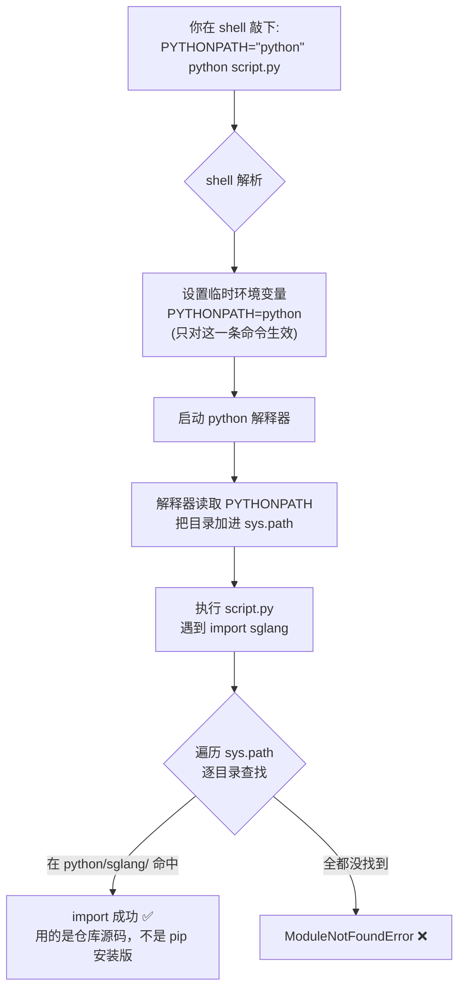
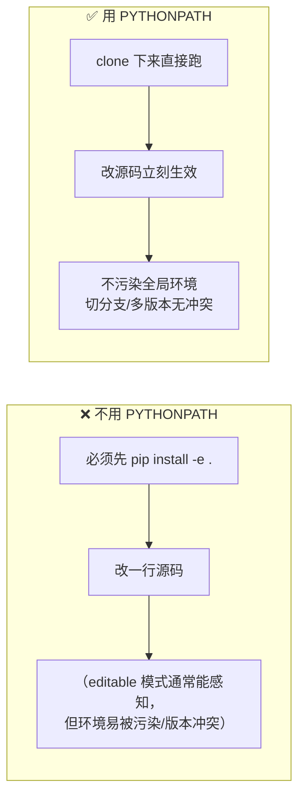
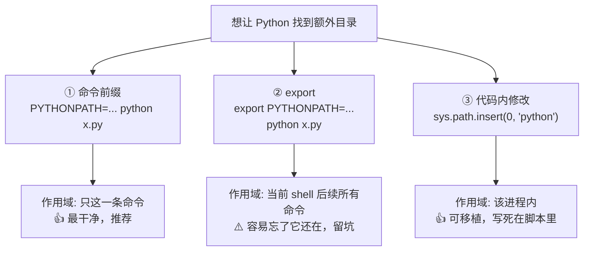

# PYTHONPATH 是什么？——从一行命令说起

> **记录日期**: 2026-06-18
> **触发场景**: 看到仓库里跑命令时前面带了 `PYTHONPATH="python"`，不懂这是干嘛的。
> **一句话结论**: 它是临时给 Python 加「额外的找模块的目录」，让你不安装 SGLang 也能直接用源码跑脚本。

---

## 1. 那行命令长什么样

```bash
PYTHONPATH="python" python some_script.py
```

逐字拆开：

| 部分 | 含义 |
|------|------|
| `PYTHONPATH` | Python 内置环境变量，指定**额外的模块搜索路径** |
| `=` | 赋值 |
| `"python"` | 一个相对路径，指向仓库的 `python/` 目录 |
| `python some_script.py` | 真正要执行的命令 |

> 路径是**相对路径**，相对于你敲命令时所在的目录（一般就是仓库根目录
> `/Users/stream/codes/opensource/llm/sglang`）。
> 如果需要多个目录，用冒号 `:` 分隔（如 `PYTHONPATH="python:test"`）。

---

## 2. Python 是怎么找模块的？（核心原理）

当你写 `import sglang` 时，Python 不会凭空知道 `sglang` 在哪。
它会拿着一个**搜索路径清单** `sys.path`，从头到尾一个目录一个目录地翻，
**找到第一个就用，找不到就报 `ModuleNotFoundError`**。

```
你写： import sglang
          │
          ▼
   ┌─────────────────────────────────────────────┐
   │  Python 遍历 sys.path（从上往下，找到即停）   │
   ├─────────────────────────────────────────────┤
   │  [0] ''                  ← 脚本所在目录       │
   │  [1] python              ← PYTHONPATH 加的    │ ⭐ 在这找到 sglang/
   │  [2] /usr/lib/python3.x  ← 标准库             │
   │  [3] .../site-packages   ← pip 装的第三方包    │
   └─────────────────────────────────────────────┘
                    │
                    ▼
        在 python/sglang/ 找到了 → import 成功 ✅
```

`PYTHONPATH` 做的事，就是把它列的目录**插到 `sys.path` 比较靠前的位置**。
于是从 `python/` 能 import 到 **SGLang 本体**（源码就在 `python/sglang/` 下）。

---

## 3. 整体数据流：一条命令发生了什么



---

## 4. 为什么要这么用？（最实际的价值）

**让你在不执行 `pip install -e .` 的情况下，直接用仓库源码跑脚本。**



适用场景：本地开发、调试、跑学习文档里的示例代码。

---

## 5. 三种等价/相关写法对比



对应代码：

```bash
# ① 命令前缀（最推荐，临时、不留痕）
PYTHONPATH="python" python some_script.py
```

```bash
# ② export：对当前 shell 后续所有命令都生效
export PYTHONPATH="python"
python some_script.py     # 生效
python another.py         # 也生效 ← 注意别忘了它一直在
```

```python
# ③ 在 Python 代码里改 sys.path（insert(0,...) = 放最前面，优先级最高）
import sys
sys.path.insert(0, "python")
import sglang  # 现在能找到了
```

---

## 6. 快速验证小技巧

想确认 `PYTHONPATH` 到底有没有生效、`sys.path` 长啥样：

```bash
# 看 sglang 是从哪个目录被 import 进来的
PYTHONPATH="python" python -c "import sglang; print(sglang.__file__)"
# 期望输出类似: .../sglang/python/sglang/__init__.py  ← 证明用的是仓库源码

# 打印完整搜索路径，确认目录排在前面
PYTHONPATH="python" python -c "import sys; print('\n'.join(sys.path))"
```

---

## 7. 常见坑

| 坑 | 现象 | 解法 |
|----|------|------|
| 用了分号 `;` 而非冒号 | macOS 上路径分隔失败 | Linux/macOS 一律用 `:` |
| 相对路径但不在仓库根目录敲命令 | `ModuleNotFoundError` | 在仓库根目录执行，或写绝对路径 |
| `export` 后忘了它还在 | 别的项目 import 到错误的源码 | 用完 `unset PYTHONPATH`，或优先用命令前缀写法 |
| 同时 `pip install` 了又设 PYTHONPATH | 不确定用的哪份代码 | 用 `print(sglang.__file__)` 确认来源 |

---

## 一句话回顾

> `PYTHONPATH="python"` = 临时告诉 Python：
> 「import 时除了默认位置，也去 `python/` 里翻一翻」，
> 从而让仓库源码可以被直接 import，无需安装。
