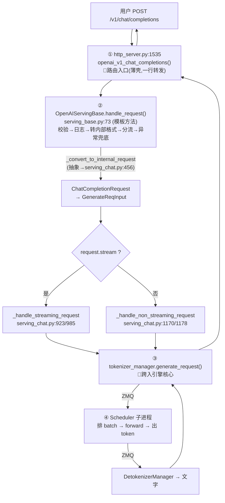

# Chat 请求入口链路(/v1/chat/completions 怎么进到引擎)

> **记录日期**: 2026-06-18
> **触发场景**: server 起来后,用户发一个 chat 请求,想知道入口在哪、怎么一步步进到 SGLang 引擎核心。
> **一句话结论**: 入口是 `http_server.py:1535` 的 `openai_v1_chat_completions`(FastAPI 路由薄壳),它转发给 `OpenAIServingChat.handle_request`,经协议层处理后,最终由 `tokenizer_manager.generate_request()` 跨入引擎核心(ZMQ → Scheduler)。

---

## 一、入口:FastAPI 路由(薄壳)

`python/sglang/srt/entrypoints/http_server.py:1535`

```python
@app.post("/v1/chat/completions", dependencies=[Depends(validate_json_request)])
async def openai_v1_chat_completions(request: ChatCompletionRequest, raw_request: Request):
    """OpenAI-compatible chat completion endpoint."""
    return await raw_request.app.state.openai_serving_chat.handle_request(
        request, raw_request
    )
```

只有一行:接住 HTTP,转交给 `app.state.openai_serving_chat`。**路由层只负责"接请求",业务逻辑全在 serving 对象。**

> `app.state.openai_serving_chat` 是启动时注册的(`http_server.py:324`,`OpenAIServingChat(...)` 实例)——接上 [[2026-06-18-sglang-server-launch-flow]] 里 `_setup_and_run_http_server` / lifespan 把对象挂到 `app.state` 的逻辑。

---

## 二、协议层:`handle_request` 模板方法(serving_base.py:73)

`OpenAIServingChat` 继承自 `OpenAIServingBase`,`handle_request` 定义在基类,是**模板方法**——固定流程骨架,可变步骤交给子类(抽象方法):

```python
async def handle_request(self, request, raw_request):
    received_time = monotonic_time()
    # ① 校验
    error_msg = self._validate_request(request)
    if error_msg: return self.create_error_response(error_msg)
    # ② 记录原始 OpenAI 请求(可选)
    # ③ 转成内部格式  ← 抽象方法,chat 走 serving_chat.py:456
    adapted_request, processed_request = self._convert_to_internal_request(request, raw_request)
    # ④ 按 stream 分流
    if request.stream:
        return await self._handle_streaming_request(adapted_request, processed_request, raw_request)
    else:
        return await self._handle_non_streaming_request(adapted_request, processed_request, raw_request)
    # ⑤ 统一异常处理: HTTPException/ValueError/.../Exception → create_error_response
```

> `_convert_to_internal_request` 是 `@abstractmethod`,chat 的实现在 `serving_chat.py:456`——怎么找具体实现见 [[2026-06-18-find-abstractmethod-implementation]]。
> 整个 `handle_request` 外面包了多层 `try/except`,把各类异常统一转成标准错误响应(400/500 等)。

---

## 三、引擎入口:`tokenizer_manager.generate_request()`

流式 / 非流式最终都落到这一句——**OpenAI 协议层与引擎核心的分界线**:

```python
# 非流式  serving_chat.py:1178
ret = await self.tokenizer_manager.generate_request(adapted_request, raw_request).__anext__()

# 流式    serving_chat.py:985
async for content in self.tokenizer_manager.generate_request(adapted_request, raw_request):
    ...
```

> `generate_request` 是异步生成器:流式逐段 `async for` 取;非流式用 `.__anext__()` 取第一个(也是唯一)结果。再往后就是 **ZMQ → Scheduler 子进程**那条已知的路。

---

## 四、全链路图



---

## 五、分层小结(及为什么这样分)

| 层 | 文件:行 | 职责 |
|----|---------|------|
| **路由入口** | `http_server.py:1535` | FastAPI 接 HTTP,一行转发(薄壳) |
| **协议层** | `serving_base.py:73`(模板) + `serving_chat.py`(实现) | 校验、转 OpenAI→内部格式、流式/非流式分流、组装响应、异常兜底 |
| **引擎入口** | `tokenizer_manager.generate_request()` | 跨入 SGLang 核心,经 ZMQ 发往 Scheduler |

> SGLang 要同时兼容 OpenAI / Anthropic / Ollama 多套 API(`entrypoints/` 下各有目录),它们最终都汇聚到同一个 `tokenizer_manager.generate_request()`。**路由层薄、协议层各自适配、引擎入口统一**——适配器模式。

---

## 一句话回顾

> chat 入口 = `http_server.py:1535` 的路由薄壳 → `OpenAIServingBase.handle_request`(模板方法:校验/转格式/分流/兜底) → chat 的 `_convert_to_internal_request`(serving_chat.py:456)→ `tokenizer_manager.generate_request()` 跨入引擎(ZMQ→Scheduler)。
