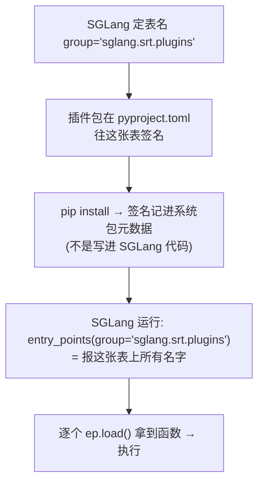
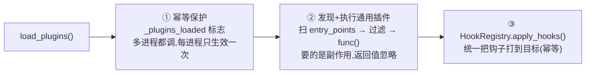

# SGLang 插件机制 & entry_points

> **记录日期**: 2026-06-18
> **触发场景**: 看到 `sglang.srt.plugins.load_plugins`,不懂插件怎么被发现的、entry_points 是啥。
> **一句话结论**: SGLang 靠 Python 打包标准 **entry_points**(一张全局"报名表")发现第三方插件——用户 `pip install` 了插件包,SGLang 启动时自动加载,**全程不需要 SGLang 源码认识任何具体插件**。主要给新硬件厂商(NPU、国产卡)免改主仓库地接入。

---

## 一、核心机制:entry_points = 报名表

主程序定个"表名"(group),插件包在自己的 `pyproject.toml` 里往这张表签名,pip 把签名记进**已安装包的元数据**。运行时主程序按表名一查就拿到所有插件。



一个 entry_point 的格式:

```
my_ascend_plugin = "sglang_ascend.plugin:setup"
└──────┬───────┘   └────────┬──────────┘ └─┬─┘
     name(插件名)        模块路径         函数名
                    冒号左边=模块, 右边=模块里的对象
```

---

## 二、完整例子:写一个 SGLang 插件包

```python
# ① 插件代码  sglang_ascend/plugin.py  (第三方包,不在 SGLang 仓库)
def setup():
    """SGLang 启动时会自动调用。要的是副作用,返回值被忽略。"""
    print("[ascend] 插件被加载了！注册昇腾 NPU 支持...")
    # 真实场景: HookRegistry.register(...) / 替换类 / 注册硬件平台
```

```toml
# ② 在打包配置里"签名"  sglang_ascend/pyproject.toml
[project]
name = "sglang-ascend"

[project.entry-points."sglang.srt.plugins"]   # ⭐ 表名必须和 SGLang 约定的一致
my_ascend_plugin = "sglang_ascend.plugin:setup"
```

```bash
# ③ 安装 → pip 把 entry_point 记进元数据
pip install sglang-ascend
```

```python
# ④ SGLang 自动发现并执行 (load_plugins 内部逻辑简化版)
from importlib.metadata import entry_points
for ep in entry_points(group="sglang.srt.plugins"):
    func = ep.load()   # 等价 from sglang_ascend.plugin import setup
    func()             # → 打印 "[ascend] 插件被加载了！"
# 注意: SGLang 源码里从没出现过 "sglang_ascend" 这个名字
```

---

## 三、为什么不直接 import?

| 维度 | 硬编码 `import` | entry_points |
|------|--------------|--------------|
| SGLang 要知道插件名吗 | 要 | **不要** |
| 加新插件改主代码吗 | 改 | **不改** |
| 没装插件包 | ImportError | 安静跳过 |
| 谁决定加载谁 | SGLang 作者 | **用户(装不装)** |

> 同一套机制还撑起了 `[project.scripts]`(装包后多出 `sglang` 命令)、pytest 插件等。类比:**浏览器扩展**——本体不认识任何扩展,只定义插槽规范,装了哪个就加载哪个。

---

## 四、`load_plugins()` 做的三件事



两类插件(`python/sglang/srt/plugins/__init__.py` 注释写明):

| 类型 | group | 用途 | 控制环境变量 |
|------|------|------|------|
| 硬件平台插件 | `sglang.srt.platforms` | 注册自定义硬件平台 | `SGLANG_PLATFORM`(多个选一个) |
| 通用插件 | `sglang.srt.plugins` | 注入 hook / 替换类 | `SGLANG_PLUGINS`(逗号分隔白名单) |

**一处工程防护**:设了 `SGLANG_PLATFORM` 后,提供**其他**硬件平台的包会被跳过、**连 import 都不做**——避免拽进没在用的硬件厂商的一堆专属依赖(可能装不上/崩)。

调用点:进程入口都调它(`launch_server.py`、`cli/serve.py`、`entrypoints/engine.py`、`managers/scheduler.py`、`platforms/__init__.py`),对应注释 "early in every process"。

> ⚠️ `SGLANG_PLATFORM` / `SGLANG_PLUGINS` 这俩环境变量的命名/定义有项目规范(`environ.py`),改它们要走 `env-var-conventions` skill。

---

## 一句话回顾

> entry_points 是 Python 打包标准里的"全局报名表":主程序定 group,插件在 `pyproject.toml` 签名(name → 模块:函数),`pip install` 记进元数据,运行时按 group 一查即得。SGLang 用它做硬件/功能插件,`load_plugins()` 负责发现→执行→应用钩子,全程主仓库零改动。
