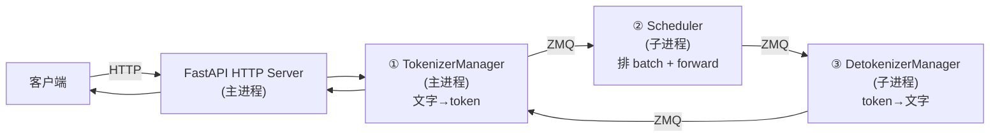
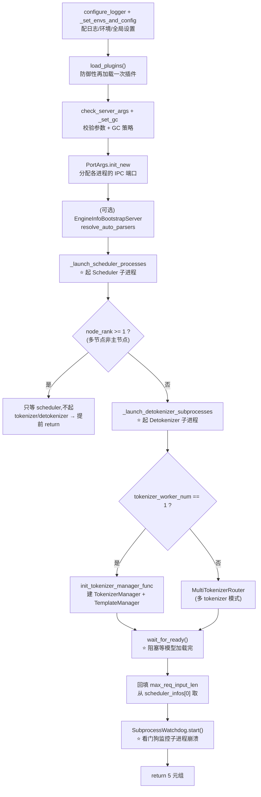
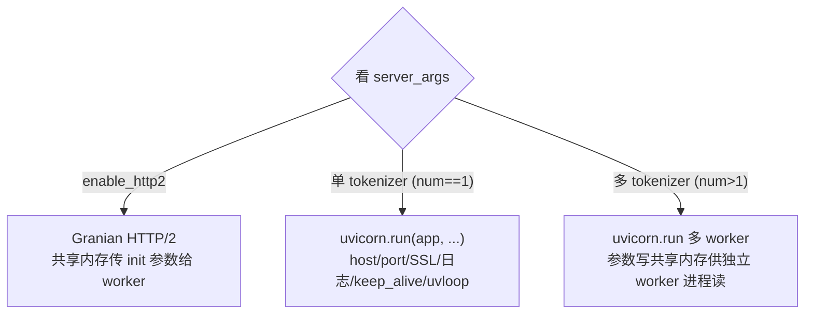
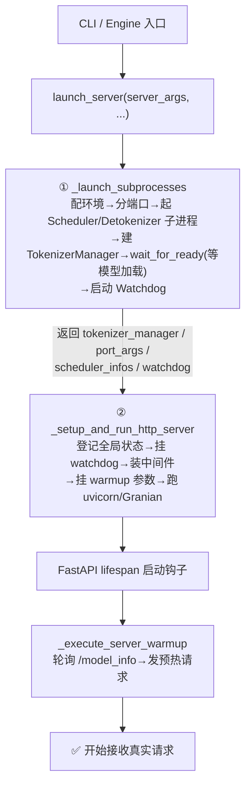

# SGLang Server 启动全链路(launch_server)

> **记录日期**: 2026-06-18
> **触发场景**: 想搞清 `_setup_and_run_http_server` 初始化了啥,顺藤摸瓜整理整条 server 启动链路。
> **一句话结论**: `launch_server` = **两步**——① `_launch_subprocesses` 起子进程并拿回核心对象 → ② `_setup_and_run_http_server` 把 HTTP 层装配好并跑起来。核心对象在第①步创建,第②步只做"装配 + 启动"。
> 代码位置:`python/sglang/srt/entrypoints/{http_server.py, engine.py}`

---

## 一、SRT Server 的架构(docstring 原话)

SRT(SGLang Runtime)server = **一个 HTTP server + 一个 SRT engine**,engine 含三个组件:



> 关键事实(docstring):**HTTP server / Engine / TokenizerManager 都跑在主进程**;Scheduler 和 Detokenizer 是**独立子进程**;进程间用 **ZMQ**(各进程不同端口)通信。

---

## 二、`launch_server` 本体:就两步

```python
def launch_server(server_args, init_tokenizer_manager_func=..., run_scheduler_process_func=...,
                  run_detokenizer_process_func=..., execute_warmup_func=..., launch_callback=None):
    # 第①步: 起子进程,拿回核心对象
    (tokenizer_manager, template_manager, port_args,
     scheduler_init_result, subprocess_watchdog) = Engine._launch_subprocesses(...)

    # 第②步: 装配并运行 HTTP server
    _setup_and_run_http_server(server_args, tokenizer_manager, template_manager,
        port_args, scheduler_init_result.scheduler_infos, subprocess_watchdog, ...)
```

> 那几个 `*_func=` 默认参数是**依赖注入**(默认标准实现,测试/Ray 可替换),语法见 [[2026-06-18-python-function-signature-vs-java]]。
> Ray 后端正是复用这套:`ray/http_server.py` 自己起 actor,再调同一个 `_setup_and_run_http_server`,见 [[2026-06-18-python-local-import]] 里讲的两个包关系。

---

## 三、第①步 `_launch_subprocesses` 做的事(engine.py:754)

按代码顺序:



它初始化/产出的关键信息:

| 产物 | 说明 |
|------|------|
| `tokenizer_manager` | 主进程里的请求总管(单 tokenizer 模式)或 `MultiTokenizerRouter`(多模式) |
| `template_manager` | chat template 管理器(多 tokenizer 模式下为 `None`) |
| `port_args` | 各进程间 ZMQ 通信的端口分配(`PortArgs.init_new`) |
| `scheduler_init_result` | scheduler 初始化结果,含 `scheduler_infos`(`max_req_input_len` 等元信息) |
| `subprocess_watchdog` | 子进程存活看门狗,检测 scheduler/detokenizer 崩溃 |

几个值得记的细节:
- **`wait_for_ready()`** 会**阻塞**,直到 scheduler 把模型加载完——这是启动慢的主要来源。
- **多节点**:`node_rank >= 1` 的节点不需要 tokenizer/detokenizer,起完 scheduler 就 return(或挂个 dummy health-check server)。
- **`scheduler_procs=None`** 是 RayEngine 的标志(它用 Ray actor 而非 `mp.Process`),看门狗代码对此做了兼容。

---

## 四、第②步 `_setup_and_run_http_server` 初始化了哪些信息(http_server.py:2169)

它**不创建**核心对象(都是参数传入),只做"HTTP 层装配 + 启动":

### ① 全局状态 `_GlobalState`(最核心)

```python
set_global_state(_GlobalState(
    tokenizer_manager=tokenizer_manager,
    template_manager=template_manager,
    scheduler_info=scheduler_infos[0],   # 取第 0 个 scheduler 的元信息
))
```
> 登记成全局单例,**让所有 FastAPI 路由函数都能访问**这三个后端对象。

### ② 子进程看门狗挂到 tokenizer_manager
```python
tokenizer_manager._subprocess_watchdog = subprocess_watchdog  # 给 SIGQUIT 处理器当"单一数据源"
```

### ③ 中间件(按开关装配)
- `enable_metrics` → Prometheus 监控中间件
- 单 tokenizer 模式 + 配了 `api_key`/`admin_api_key`(或有 ADMIN_FORCE 端点) → API key 鉴权中间件

### ④ 给 `app` 挂参数(单 tokenizer 模式),留给 lifespan 用
```python
app.is_single_tokenizer_mode = True
app.server_args = server_args
app.warmup_thread_kwargs = dict(server_args=..., launch_callback=..., execute_warmup_func=...)
```
> warmup 的参数挂在 `app` 上,由 FastAPI **lifespan** 启动钩子取用——这是预热的衔接点。

### ⑤ 按模式启动服务器


> 多进程模式下 worker 拿不到内存对象,用 `write_data_for_multi_tokenizer` 把 `(port_args, server_args, scheduler_info)` 写进**共享内存**让 worker 读。SSL 配置(certfile/keyfile/ca_certs)、`timeout_keep_alive`、`loop="uvloop"` 等全来自 `server_args`。

---

## 五、预热 `_execute_server_warmup`(http_server.py:1912)

server 跑起来后由 lifespan 触发,逻辑:

1. **轮询等待就绪**:循环最多 120 次(每次 sleep 1s),GET `/model_info` 直到返回 200。失败就 `kill_process_tree` 自杀。
2. **构造一个预热请求**:按模型类型选端点——生成模型 `/generate`(VLM 用 `/v1/chat/completions`),非生成模型 `/encode`;`max_new_tokens` 生成=8、非生成=1,`temperature=0`。
3. 目的:**触发一次真实前向,把 CUDA kernel / cudagraph / 显存都热身好**,避免第一个真实请求超慢。

---

## 六、全链路一张图



---

## 一句话回顾

> `launch_server` 只做两件事:**起子进程拿对象**(`_launch_subprocesses`:配环境→分 ZMQ 端口→起 Scheduler/Detokenizer 子进程→建 TokenizerManager→阻塞等模型加载→开看门狗)+ **装配跑 HTTP**(`_setup_and_run_http_server`:全局状态/看门狗/中间件/warmup 参数→uvicorn)。最后 lifespan 触发 warmup 预热,server 才真正就绪。核心对象都在第一步生,第二步只装配。
