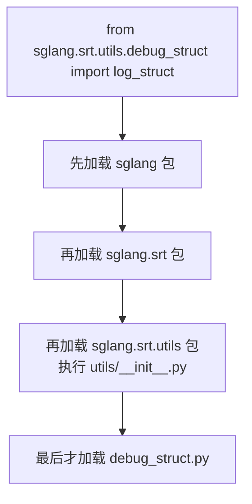
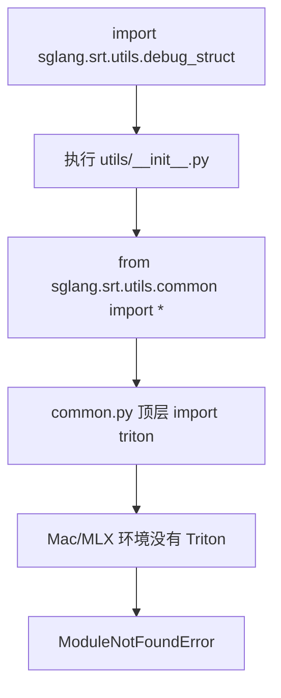
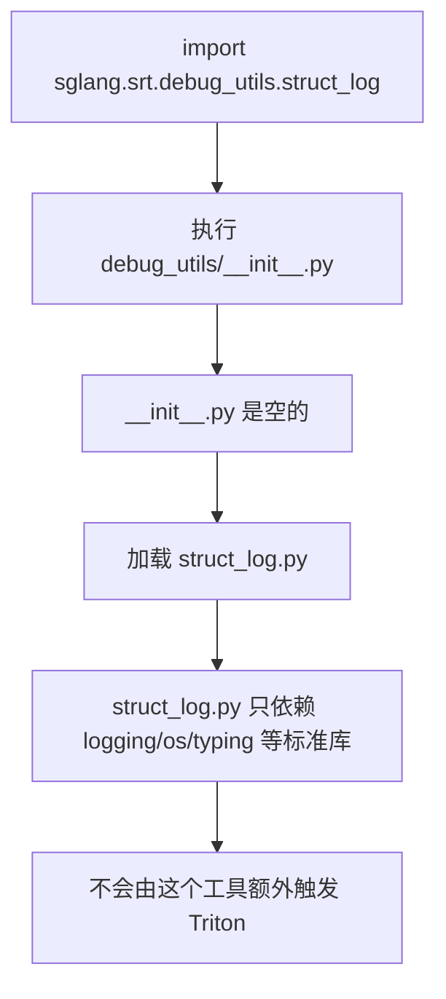

# Python 包导入链 & Triton 被意外加载

> **记录日期**: 2026-06-19
> **触发场景**: 给 SGLang 加结构日志工具时,一开始放到 `sglang.srt.utils.debug_struct`,结果只是导入调试工具也触发了 `import triton` 报错。
> **一句话结论**: Python 导入子模块前会先执行每一级包的 `__init__.py`;把轻量调试工具放进 `sglang.srt.utils` 会先跑 `utils/__init__.py`,间接加载 `common.py -> import triton`。移到 `sglang.srt.debug_utils` 后,因为这个包的 `__init__.py` 是空的,就不会由这个调试工具额外触发 Triton。

---

## 现象

本来只是想写一个轻量工具:

```python
from sglang.srt.utils.debug_struct import log_struct
```

但在 Mac 环境里,它可能报:

```text
ModuleNotFoundError: No module named 'triton'
```

看起来很反直觉:我明明只是导入 `debug_struct.py`,为什么会去找 Triton?

---

## 关键知识:导入子模块前,会先加载父包

Python 里的目录如果有 `__init__.py`,它就是一个 package。导入深层模块时,Python 不是直接跳到最后那个 `.py` 文件,而是从左到右逐层加载。

比如:

```python
from sglang.srt.utils.debug_struct import log_struct
```

Python 实际会按顺序处理:

```text
1. sglang/__init__.py
2. sglang/srt/__init__.py
3. sglang/srt/utils/__init__.py
4. sglang/srt/utils/debug_struct.py
```



重点是第 3 步:只要 `utils/__init__.py` 里 import 了别的东西,那些东西也会被执行。

---

## 为什么会触发 Triton

SGLang 的 `sglang.srt.utils` 包不是一个空壳。它的 `__init__.py` 会导入 `common.py` 里的内容,而 `common.py` 顶层有:

```python
import triton
```

所以导入链变成:

```text
导入 sglang.srt.utils.debug_struct
  -> 先执行 sglang.srt.utils.__init__
  -> utils.__init__ 导入 common.py
  -> common.py 顶层 import triton
  -> Mac 环境没装/不支持 Triton
  -> ModuleNotFoundError
```



这说明:即使 `debug_struct.py` 本身完全没有写 `import triton`,只要它放在 `utils` 这个包下面,导入它之前就可能被父包的初始化逻辑带偏。

---

## 为什么移到 debug_utils 能避开

后来把文件放到:

```text
python/sglang/srt/debug_utils/struct_log.py
```

调用处改成:

```python
from sglang.srt.debug_utils.struct_log import log_struct
```

新的导入链是:

```text
1. sglang/__init__.py
2. sglang/srt/__init__.py
3. sglang/srt/debug_utils/__init__.py
4. sglang/srt/debug_utils/struct_log.py
```

关键区别:

```text
debug_utils/__init__.py 是空的
```

所以导入 `struct_log.py` 时,不会因为 `debug_utils/__init__.py` 额外拉起 `common.py -> triton`。



---

## 注意:这不是彻底修复全局 Triton 问题

这次移动文件解决的是:

> 不让“新增的结构日志工具”额外触发 `sglang.srt.utils -> triton` 导入链。

它不等于:

> 整个 SGLang 在 Mac 上再也不会导入 Triton。

如果其他启动路径本来就会导入 `sglang.srt.utils.common`,或者其他模块顶层写了 `import triton`,那还是会触发。这是另一个层面的兼容性问题。

换句话说:

| 问题 | 是否被这次移动解决 |
|------|--------------------|
| 结构日志工具放在 `utils` 下,导入它时额外触发 Triton | ✅ 解决 |
| SGLang 其他模块本来就顶层 `import triton` | ❌ 没解决 |
| Mac/MLX server 启动路径里误走 CUDA/Triton/Inductor | ❌ 需要另外改 import guard / lazy import |

---

## 对 Python 新手最重要的三点

### 1. `import a.b.c` 不只是加载 c

它会先加载:

```text
a
a.b
a.b.c
```

每一级包的 `__init__.py` 都可能执行代码。

### 2. `__init__.py` 不只是“空文件”

它可以是空的,也可以写很多初始化逻辑:

```python
# __init__.py
from .common import *
```

这类写法很方便,但会让导入包时顺带导入很多模块。

### 3. 轻量工具要避免放进“重包”

如果一个工具本来只需要标准库:

```python
import logging
import os
```

就尽量放在一个轻量目录下。否则它可能因为父包 `__init__.py` 的副作用,被迫加载 CUDA、Triton、Ray、torch 等重依赖。

---

## 和局部 import 的关系

这件事和 [局部 import(lazy import)](2026-06-18-python-local-import.md) 是同一个工程原则:

> 不在主路径上加载当前用不到的重依赖。

常见做法有两种:

| 做法 | 适用场景 |
|------|----------|
| 把 import 放进函数里 | 某个功能分支才需要重依赖,例如 Ray |
| 把轻量工具放到轻量包里 | 避免父包 `__init__.py` 顺手导入重依赖,例如这次的 `debug_utils/struct_log.py` |

---

## 一句话回顾

> Python 导入 `a.b.c` 会先执行 `a`、`a.b` 的 `__init__.py`。所以模块放在哪个包下面很重要:放进 `sglang.srt.utils` 会经过 `utils/__init__.py -> common.py -> import triton`;放进空壳的 `sglang.srt.debug_utils` 则不会由这个调试工具额外触发 Triton。
