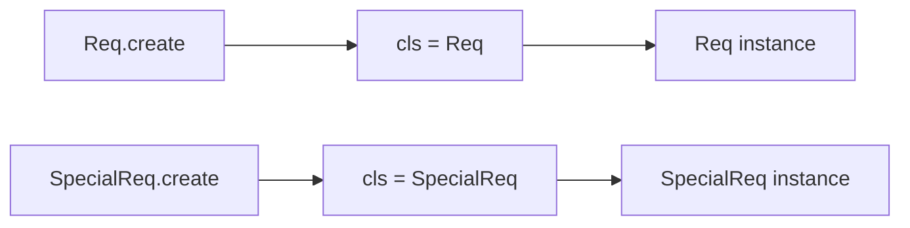

# Python `self` / `cls` 对比 Java `this` / 工厂模式

> **记录日期**: 2026-06-21
> **触发场景**: 阅读 `Scheduler.stash_chunked_request(self, req)` 时，不理解为什么有些 Python 函数第一个参数是 `self`，以及 `@classmethod` 是否等价于 Java 抽象工厂。
> **一句话结论**: `self` 对应 Java 隐式的 `this`；`cls` 表示实际调用的类，常用于支持继承的替代构造器。`classmethod` 更接近多态 Factory Method，不等于创建一族产品的 Abstract Factory。

---

## 1. `self` 是显式写出来的 `this`

Python：

```python
class Scheduler:
    def stash_chunked_request(self, req):
        print(self.tree_cache)
```

调用：

```python
scheduler.stash_chunked_request(req)
```

可以理解成：

```python
Scheduler.stash_chunked_request(scheduler, req)
```

因此：

```text
self = scheduler
req  = 调用者显式传入的请求
```

Java 对应写法：

```java
class Scheduler {
    private TreeCache treeCache;

    void stashChunkedRequest(Req req) {
        System.out.println(this.treeCache);
    }
}
```

```java
scheduler.stashChunkedRequest(req);
```

两种语言都会把当前对象传给实例方法，差别只是方法签名：

```text
Python: def stash_chunked_request(self, req)
Java:   void stashChunkedRequest(Req req) // this 隐式存在
```

`self` 不是 Python 关键字，而是强约定。技术上可以换名字，但不应该换。

## 2. 为什么有些函数没有 `self`

只有实例方法才自动接收当前对象。Python 常见的四种函数：

```python
def module_function(x):
    return x * 2


class Example:
    def instance_method(self, x):
        return self.value + x

    @classmethod
    def class_method(cls, x):
        return cls(x)

    @staticmethod
    def static_method(x):
        return x * 2
```

| Python 形式 | 自动传入 | Java 近似概念 |
|---|---|---|
| 模块函数 | 无 | 类外工具函数；Java 通常放进工具类的 `static` 方法 |
| 实例方法 | 当前对象 `self` | 实例方法中的隐式 `this` |
| `@classmethod` | 实际调用类 `cls` | 没有完全等价语法；接近可继承工厂方法 |
| `@staticmethod` | 无 | `static` 方法 |

## 3. 字段访问：`self.field` 与 `this.field`

Python 通常显式写 `self`：

```python
class Req:
    def set_fill_len(self, fill_len):
        self.fill_len = fill_len
```

Java 可以省略 `this`，但字段和参数同名时通常写出来：

```java
class Req {
    private int fillLen;

    void setFillLen(int fillLen) {
        this.fillLen = fillLen;
    }
}
```

Python 如果写成下面这样，只会修改局部变量，不会修改对象字段：

```python
def set_fill_len(self, fill_len):
    fill_len = fill_len  # 没有修改 self.fill_len
```

## 4. `cls` 表示实际调用的类

`@classmethod` 的第一个参数通常命名为 `cls`：

```python
class Req:
    def __init__(self, rid):
        self.rid = rid

    @classmethod
    def create(cls, rid):
        return cls(rid)
```

从父类调用：

```python
req = Req.create("r1")
type(req) is Req
```

从子类调用：

```python
class SpecialReq(Req):
    pass

req = SpecialReq.create("r2")
type(req) is SpecialReq
```

继承来的 `create()` 没有写死 `Req(...)`，而是调用 `cls(...)`。所以调用者是哪个类，就创建哪个类。



这常被称为替代构造器、多态构造或 virtual constructor。

## 5. 为什么不完全等价于 Java 静态工厂

Java 静态工厂：

```java
class Req {
    protected Req(String rid) {}

    static Req create(String rid) {
        return new Req(rid);
    }
}
```

Java 的 `static` 方法不进行动态分派。子类即使能通过类名调用继承来的静态方法，方法体仍然写死返回 `new Req(...)`，不会因为调用者是 `SpecialReq` 就自动返回子类。

```text
Python cls(...): 运行时调用类决定实例类型
Java static:     声明的方法体决定实例类型
```

所以 Python `@classmethod` 同时具备两层含义：

1. 像 Java 静态工厂一样提供命名构造入口，例如 `Req.from_json(...)`。
2. 使用 `cls(...)` 时又具备普通 Java 静态工厂没有的继承多态。

## 6. `classmethod` 更接近 Factory Method

如果要在 Java 中表达“具体类型决定创建哪种对象”，通常会使用可覆盖的 Factory Method：

```java
abstract class ReqFactory {
    abstract Req create(String rid);
}

class NormalReqFactory extends ReqFactory {
    @Override
    Req create(String rid) {
        return new Req(rid);
    }
}

class SpecialReqFactory extends ReqFactory {
    @Override
    Req create(String rid) {
        return new SpecialReq(rid);
    }
}
```

具体 Factory 的动态类型决定创建哪一种 `Req`，这与 Python `cls(...)` 的多态意图更接近。

但二者结构仍不完全相同：Python 直接把“被创建的类”作为 `cls` 传入；Java 示例引入了独立的 Factory 对象。

## 7. 为什么不是 Abstract Factory

Abstract Factory 解决的是“创建一族相互匹配的产品”：

```java
interface UIFactory {
    Button createButton();
    Dialog createDialog();
}

class WindowsUIFactory implements UIFactory {
    public Button createButton() { return new WindowsButton(); }
    public Dialog createDialog() { return new WindowsDialog(); }
}

class MacUIFactory implements UIFactory {
    public Button createButton() { return new MacButton(); }
    public Dialog createDialog() { return new MacDialog(); }
}
```

它保证产品族一致：

```text
WindowsFactory -> WindowsButton + WindowsDialog
MacFactory     -> MacButton     + MacDialog
```

普通 Python classmethod 通常只创建当前类的一个实例：

```text
SpecialReq.create(...) -> SpecialReq
```

因此判断标准不是“有没有工厂这个词”，而是它解决的问题：

| 机制 | 主要问题 |
|---|---|
| Python `classmethod` 替代构造器 | 如何根据实际调用类创建一个实例 |
| Static Factory | 如何用有意义的方法名封装对象创建 |
| Factory Method | 如何让子类/具体实现决定产品类型 |
| Abstract Factory | 如何创建一整族相互匹配的产品 |

## 8. SGLang 代码中的读法

看到：

```python
class Scheduler:
    def stash_chunked_request(self, req):
        maybe_cache_unfinished_req(req, self.tree_cache, chunked=True)
```

按 Java 心智模型翻译：

```java
class Scheduler {
    private TreeCache treeCache;

    void stashChunkedRequest(Req req) {
        maybeCacheUnfinishedReq(req, this.treeCache, true);
    }
}
```

这里：

- `self` 是当前 `Scheduler` 实例。
- `req` 是显式业务参数。
- `self.tree_cache` 是当前 Scheduler 持有的依赖。
- `maybe_cache_unfinished_req(...)` 是模块函数，所以没有 `self`。

## 9. 最小记忆版

```text
self ≈ Java this，但 Python 把它显式写进参数列表。
cls  = 实际调用的类，不是当前实例。
@staticmethod ≈ Java static。
@classmethod 常用于替代构造器；cls(...) 可以保留子类类型。
classmethod 更接近多态 Factory Method，不等于 Abstract Factory。
Abstract Factory 的标志是创建一族相关产品。
```

延伸阅读：[Python Truthiness 对比 Java Boolean](./2026-06-21-python-truthiness-vs-java-boolean.md) · [Python 函数签名语法 vs Java](./2026-06-18-python-function-signature-vs-java.md) · [Python 对象引用 vs Java](./2026-06-18-python-vs-java-object-reference.md)
